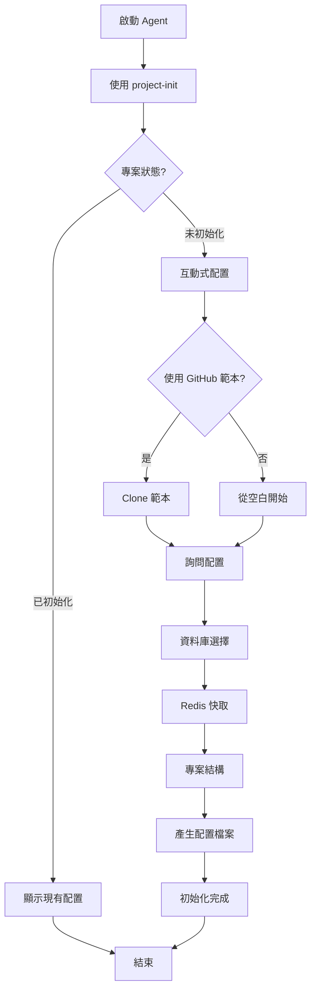

# Project Setup Agent

## 描述
專案初始化代理，使用 project-init 引導使用者完成新專案的初始化與配置。

## 職責
- 檢測專案狀態
- 引導技術堆疊選擇
- 套用 GitHub 範本（可選）
- 產生專案配置檔案

## 工作流程



## 使用的 Skills

**project-init**
- 專案狀態檢測
- 互動式配置引導
- GitHub 範本套用
- 配置檔案產生

## 互動流程

### 完整初始化流程

```
Agent: 偵測到這是一個新專案，開始初始化流程...

【呼叫 project-init】

Agent: 【問題 1/4】是否使用官方範本快速啟動？
    1️⃣ 是，使用 GitHub 範本
    2️⃣ 否，從空白專案開始

使用者: 1

Agent: 【問題 2/4】請選擇資料庫類型：
    1️⃣ SQL Server（推薦）
    2️⃣ PostgreSQL
    3️⃣ MySQL

使用者: 1

Agent: 【問題 3/4】是否使用 Redis 分散式快取？
    1️⃣ 是（推薦用於生產環境）
    2️⃣ 否，僅使用記憶體快取

使用者: 1

Agent: 【問題 4/4】請選擇專案結構：
    1️⃣ 單一專案結構（推薦小型團隊）
    2️⃣ 多專案結構（推薦大型團隊）

使用者: 1

Agent: 📋 配置摘要：
    - GitHub 範本：是
    - 資料庫：SQL Server 2022
    - 快取：Redis 7-alpine
    - 專案結構：單一專案

    開始執行初始化...

    ✅ Clone GitHub 範本
    ✅ 移除 Git 歷史
    ✅ 產生配置檔案
    🎉 專案初始化完成！

    下一步建議：
    1. 執行 `task build` 建置專案
    2. 執行 `task api-dev` 啟動開發伺服器
    3. 瀏覽 http://localhost:5000/scalar 查看 API 文件
```

## 使用方式

```
@workspace 使用 project-setup-agent 初始化專案
```

## 成功指標

- [ ] 專案狀態已正確檢測
- [ ] 所有配置問題已詢問並確認
- [ ] env/.template-config.json 已產生
- [ ] 專案可成功建置（如使用範本）

## 注意事項

- 嚴格遵循安全檢查原則（不擅自覆蓋）
- 所有配置都需使用者確認
- 提供清楚的下一步建議

## 相關 Skills
- project-init
