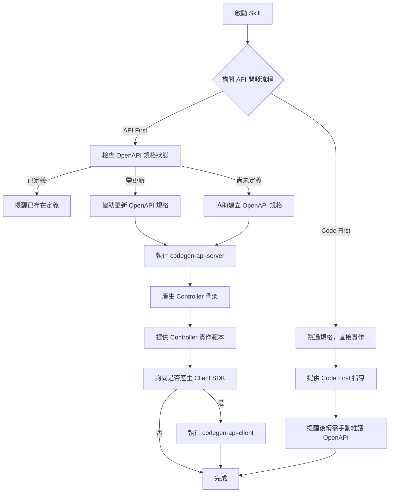

# API Development Skill

## 描述
API 開發流程引導技能，協助開發者選擇合適的開發流程（API First 或 Code First），並提供 OpenAPI 規格管理、程式碼產生等自動化支援。

## 職責
- 引導選擇 API First 或 Code First 開發流程
- 協助更新/建立 OpenAPI 規格（doc/openapi.yml）
- 產生 Server Controller 骨架
- 產生 Client SDK
- 提供 Controller 實作指導

## 能力

### 1. 開發流程決策引導
協助開發者根據專案需求選擇合適的 API 開發流程：
- **API First（推薦）**：契約優先，文件與實作同步
- **Code First**：快速開發，後續維護文件

### 2. OpenAPI 規格管理
- 檢查 doc/openapi.yml 是否存在
- 引導新增/修改 API 端點定義
- 提供 OpenAPI 3.0 規格範本
- 驗證規格檔案格式

### 3. 程式碼自動產生
- **Server Controller 產生**：執行 `task codegen-api-server`
- **Client SDK 產生**：執行 `task codegen-api-client`
- 產生位置自動化管理

### 4. Controller 實作協助
- 提供 Controller 實作範本
- Result Pattern 整合指導
- HTTP 狀態碼映射建議

## 使用方式

### 在 GitHub Copilot 中使用
```
@workspace 我想要開發新的 API 端點
```

### 直接呼叫 Skill
```
使用 api-development 開發 API
```

## 互動流程



## 互動問答範例

### 問題 1：API 開發流程選擇

```
請選擇 API 開發流程：

1️⃣ API First（推薦）
   ✅ API 文件與實作 100% 同步
   ✅ 前後端可並行開發
   ✅ 自動產生 Client SDK
   ✅ 編譯時契約檢查
   ⚠️ 需先設計 API 規格

   適用場景：
   - 前後端分離且團隊並行開發
   - 需要提供 Client SDK 給第三方
   - API 穩定性要求高
   - 多個客戶端（Web、Mobile、Desktop）

2️⃣ Code First
   ✅ 快速啟動開發
   ✅ 直接實作程式碼
   ⚠️ 需手動維護 API 文件
   ⚠️ 文件與實作可能不同步

   適用場景：
   - 快速原型驗證
   - 內部小型專案
   - API 結構仍在快速變動中
   - 單人開發或小團隊
```

### 問題 2：OpenAPI 規格定義狀態（僅 API First）

```
請確認 OpenAPI 規格狀態：

1️⃣ 已定義
   - doc/openapi.yml 已包含此 API 的端點定義
   - 我只需要產生程式碼

2️⃣ 需要更新
   - doc/openapi.yml 存在但需要加入新的端點
   - 我需要協助修改規格

3️⃣ 尚未定義
   - doc/openapi.yml 不存在或沒有此端點
   - 我需要從頭建立規格
```

### 問題 3：需要實作的分層

```
請選擇需要實作的分層（可多選）：

☑️ Controller
   - HTTP 請求處理與路由
   - 請求驗證
   - HTTP 狀態碼對應

☑️ Handler
   - 業務邏輯處理
   - 流程協調
   - 錯誤處理與結果封裝

☑️ Repository
   - 資料存取邏輯
   - EF Core 操作
   - 資料庫查詢封裝

提示：通常需要三層都實作以完成完整功能
```

### 問題 4：是否產生 Client SDK

```
是否需要產生 Client SDK？

1️⃣ 是，產生 Client SDK
   - 自動產生強型別 API 客戶端
   - 前端可直接使用
   - 完整的 IntelliSense 支援
   - 產生位置：JobBank1111.Job.Contract/AutoGenerated/

2️⃣ 否，暫不產生
   - 僅產生 Server Controller
   - 後續可隨時執行 task codegen-api-client
```

## OpenAPI 規格範本

### 端點定義範例

```yaml
paths:
  /api/v1/members:
    post:
      summary: 建立新會員
      operationId: CreateMember
      tags:
        - Member
      requestBody:
        required: true
        content:
          application/json:
            schema:
              $ref: '#/components/schemas/CreateMemberRequest'
      responses:
        '201':
          description: 會員建立成功
          content:
            application/json:
              schema:
                $ref: '#/components/schemas/MemberResponse'
        '400':
          description: 請求驗證失敗
          content:
            application/json:
              schema:
                $ref: '#/components/schemas/Failure'
        '409':
          description: Email 已被使用
          content:
            application/json:
              schema:
                $ref: '#/components/schemas/Failure'
        '500':
          description: 內部伺服器錯誤
          content:
            application/json:
              schema:
                $ref: '#/components/schemas/Failure'

components:
  schemas:
    CreateMemberRequest:
      type: object
      required:
        - email
        - name
      properties:
        email:
          type: string
          format: email
          example: "user@example.com"
        name:
          type: string
          minLength: 1
          maxLength: 100
          example: "張三"
        phone:
          type: string
          pattern: '^\d{10}$'
          example: "0912345678"

    MemberResponse:
      type: object
      properties:
        id:
          type: string
          format: uuid
        email:
          type: string
        name:
          type: string
        createdAt:
          type: string
          format: date-time
```

## 程式碼產生命令

### Server Controller 產生
```bash
# 執行 Taskfile 命令
task codegen-api-server

# 產生位置
# JobBank1111.Job.WebAPI/Contract/AutoGenerated/
```

### Client SDK 產生
```bash
# 執行 Taskfile 命令
task codegen-api-client

# 產生位置
# JobBank1111.Job.Contract/AutoGenerated/
```

## Controller 實作指導

產生的 Controller 骨架需要實作自動產生的介面，整合以下元件：

1. **Handler 整合**：呼叫業務邏輯層
2. **Result Pattern 處理**：轉換 Result 為 HTTP 回應
3. **HTTP 狀態碼映射**：使用 FailureCodeMapper

完整實作範本請參考：`assets/controller-template.cs`

## API First vs Code First 對比

| 比較項目 | API First（推薦） | Code First |
|---------|------------------|-----------|
| **文件同步** | ✅ 自動 100% 同步 | ❌ 需手動維護 |
| **前後端協作** | ✅ 可並行開發 | ⚠️ 需等後端完成 |
| **契約保證** | ✅ 編譯時檢查 | ❌ 執行時才發現 |
| **Client SDK** | ✅ 自動產生 | ❌ 需手動實作 |
| **開發速度** | ⚠️ 需先設計 API | ✅ 快速啟動 |
| **維護成本** | ✅ 低（自動同步） | ❌ 高（手動維護） |
| **團隊協作** | ✅ 優秀 | ⚠️ 一般 |
| **適用場景** | 中大型專案、團隊協作 | 小型專案、快速原型 |

## 完整開發流程範例（API First）

### 步驟 1：定義 OpenAPI 規格
編輯 `doc/openapi.yml`，新增 API 端點定義。

### 步驟 2：產生 Server Controller
```bash
task codegen-api-server
```

產生檔案：
- `JobBank1111.Job.WebAPI/Contract/AutoGenerated/IMemberApi.cs`（介面）

### 步驟 3：實作 Controller
建立 `MemberController.cs` 實作自動產生的介面：

```csharp
[ApiController]
[Route("api/v1/members")]
public class MemberController(MemberHandler handler) : ControllerBase, IMemberApi
{
    public async Task<IActionResult> CreateMember(
        CreateMemberRequest request,
        CancellationToken cancellationToken = default)
    {
        var result = await handler.CreateMemberAsync(request, cancellationToken);

        return result.Match(
            success => StatusCode(201, success),
            failure => StatusCode(
                FailureCodeMapper.ToHttpStatusCode(failure.Code),
                failure)
        );
    }
}
```

### 步驟 4：產生 Client SDK（可選）
```bash
task codegen-api-client
```

產生檔案：
- `JobBank1111.Job.Contract/AutoGenerated/IMemberApi.cs`（Client 介面）
- `JobBank1111.Job.Contract/AutoGenerated/MemberApiClient.cs`（Client 實作）

## 參考文件
- [API 開發工作流程詳解](./references/api-development-workflow.md)

## 範本檔案
- [Controller 實作範本](./assets/controller-template.cs)
- [OpenAPI 端點範本](./assets/openapi-endpoint-template.yml)

## 注意事項

### 🔒 核心原則
1. **強制詢問**：不得擅自假設開發流程，必須明確詢問
2. **文件優先**：API First 時，規格定義必須在實作之前
3. **自動產生的程式碼不可手動編輯**：位於 AutoGenerated 資料夾

### 📋 最佳實踐
1. **API First 優先**：除非有特殊理由，建議使用 API First
2. **規格完整性**：確保 OpenAPI 規格包含完整的錯誤回應定義
3. **版本控制**：API 路徑應包含版本號（如 /api/v1/）
4. **一致性**：遵循現有 API 的命名與結構風格

### ✅ 成功指標
- [ ] OpenAPI 規格正確定義（API First）
- [ ] Server Controller 成功產生
- [ ] Controller 正確實作介面
- [ ] Client SDK 成功產生（如需要）
- [ ] API 文件與實作同步

## 錯誤處理

### codegen 命令失敗
```
❌ 錯誤：無法產生程式碼

執行命令：task codegen-api-server
錯誤訊息：OpenAPI 規格格式錯誤

建議：
1. 檢查 doc/openapi.yml 格式是否正確
2. 使用線上驗證工具：https://editor.swagger.io/
3. 確認 YAML 縮排正確（使用空格，不使用 Tab）
```

### 產生的 Controller 編譯失敗
```
❌ 錯誤：Controller 編譯失敗

錯誤訊息：CS0535: 'MemberController' does not implement interface member 'IMemberApi.CreateMember'

建議：
1. 確認方法簽章與介面定義完全一致
2. 檢查參數名稱、類型、回傳類型
3. 參考範本：assets/controller-template.cs
```

## 相關 Skills
- `handler` - Handler 業務邏輯實作
- `error-handling` - Result Pattern 錯誤處理
- `bdd-testing` - API 端點測試

## 相關 Agents
- `feature-development-agent` - 使用本 skill 的完整功能開發流程
