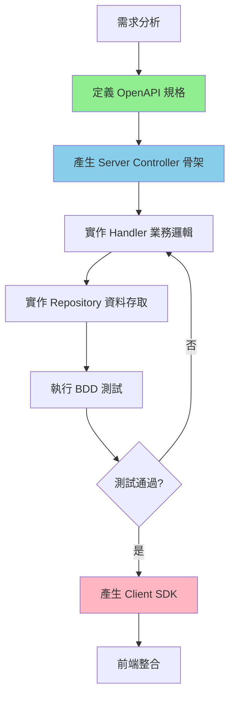
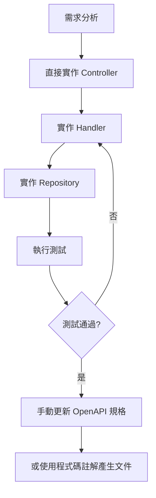

# API 開發工作流程詳解

本文件詳細說明 ASP.NET Core Web API 的開發工作流程，包含 API First 與 Code First 兩種模式的完整指引。

## API First 開發流程

### 核心理念

**契約優先（Contract First）**：先定義 API 契約（OpenAPI 規格），再產生程式碼骨架，確保：

- ✅ API 文件與實作 100% 同步
- ✅ 前後端可以並行開發（基於相同契約）
- ✅ 減少溝通成本與理解偏差
- ✅ 自動產生 Client SDK
- ✅ 編譯時契約檢查

### 完整流程圖



### 步驟 1：定義 OpenAPI 規格

#### 規格檔案位置
`doc/openapi.yml`

#### 規格結構

```yaml
openapi: 3.0.3
info:
  title: JobBank API
  version: 1.0.0
  description: 求職平台 API 服務

servers:
  - url: http://localhost:5000
    description: 本機開發環境
  - url: https://api.jobbank.com
    description: 生產環境

paths:
  # API 端點定義
  /api/v1/members:
    post:
      # 端點詳細定義

components:
  schemas:
    # 資料結構定義

  securitySchemes:
    # 身分驗證方式
```

#### 端點定義範例：建立會員

```yaml
paths:
  /api/v1/members:
    post:
      summary: 建立新會員
      description: 註冊新的會員帳號
      operationId: CreateMember
      tags:
        - Member
      requestBody:
        required: true
        content:
          application/json:
            schema:
              $ref: '#/components/schemas/CreateMemberRequest'
      responses:
        '201':
          description: 會員建立成功
          headers:
            Location:
              description: 新建立的會員資源位置
              schema:
                type: string
                example: /api/v1/members/123e4567-e89b-12d3-a456-426614174000
          content:
            application/json:
              schema:
                $ref: '#/components/schemas/MemberResponse'
        '400':
          description: 請求驗證失敗
          content:
            application/json:
              schema:
                $ref: '#/components/schemas/Failure'
              examples:
                ValidationError:
                  value:
                    code: "ValidationError"
                    message: "Email 格式不正確"
                    traceId: "0HMVD8H3F6A9K:00000001"
        '409':
          description: Email 已被使用
          content:
            application/json:
              schema:
                $ref: '#/components/schemas/Failure'
              examples:
                DuplicateEmail:
                  value:
                    code: "DuplicateEmail"
                    message: "此 Email 已被註冊"
                    traceId: "0HMVD8H3F6A9K:00000002"
        '500':
          description: 內部伺服器錯誤
          content:
            application/json:
              schema:
                $ref: '#/components/schemas/Failure'
```

#### Schema 定義範例

```yaml
components:
  schemas:
    CreateMemberRequest:
      type: object
      required:
        - email
        - name
      properties:
        email:
          type: string
          format: email
          description: 會員 Email 地址
          example: "user@example.com"
        name:
          type: string
          minLength: 1
          maxLength: 100
          description: 會員姓名
          example: "張三"
        phone:
          type: string
          pattern: '^\d{10}$'
          description: 手機號碼（10 碼數字）
          example: "0912345678"
        birthDate:
          type: string
          format: date
          description: 生日
          example: "1990-01-01"

    MemberResponse:
      type: object
      properties:
        id:
          type: string
          format: uuid
          description: 會員唯一識別碼
        email:
          type: string
          description: 會員 Email
        name:
          type: string
          description: 會員姓名
        phone:
          type: string
          description: 手機號碼
        createdAt:
          type: string
          format: date-time
          description: 建立時間

    Failure:
      type: object
      required:
        - code
        - message
        - traceId
      properties:
        code:
          type: string
          description: 錯誤代碼
          enum:
            - ValidationError
            - DuplicateEmail
            - DbError
            - Unauthorized
            - InternalServerError
        message:
          type: string
          description: 錯誤訊息
        traceId:
          type: string
          description: 追蹤識別碼
        data:
          type: object
          description: 額外的錯誤資訊
          additionalProperties: true
```

### 步驟 2：產生 Server Controller 骨架

#### 執行產生命令

```bash
task codegen-api-server
```

#### 背後執行的工具：NSwag

Taskfile.yml 中的定義：
```yaml
codegen-api-server:
  desc: 從 OpenAPI 規格產生 Server Controller
  cmds:
    - nswag run nswag-server.json
```

#### 產生的檔案

**產生位置**：`JobBank1111.Job.WebAPI/Contract/AutoGenerated/`

**產生檔案範例**：
```csharp
// IMemberApi.cs (自動產生，不可手動編輯)
namespace JobBank1111.Job.WebAPI.Contract.AutoGenerated
{
    [System.CodeDom.Compiler.GeneratedCode("NSwag", "14.0.0.0")]
    public partial interface IMemberApi
    {
        /// <summary>
        /// 建立新會員
        /// </summary>
        /// <param name="request">建立會員請求</param>
        /// <param name="cancellationToken">取消權杖</param>
        /// <returns>會員建立成功</returns>
        Task<IActionResult> CreateMember(
            CreateMemberRequest request,
            CancellationToken cancellationToken = default);
    }
}
```

### 步驟 3：實作 Controller

#### 建立檔案位置
`JobBank1111.Job.WebAPI/Member/MemberController.cs`

#### 實作範例

```csharp
using Microsoft.AspNetCore.Mvc;
using JobBank1111.Job.WebAPI.Contract.AutoGenerated;

namespace JobBank1111.Job.WebAPI.Member;

[ApiController]
[Route("api/v1/[controller]")]
public class MemberController(
    MemberHandler handler,
    ILogger<MemberController> logger) : ControllerBase, IMemberApi
{
    public async Task<IActionResult> CreateMember(
        CreateMemberRequest request,
        CancellationToken cancellationToken = default)
    {
        logger.LogInformation("開始建立會員：{Email}", request.Email);

        var result = await handler.CreateMemberAsync(request, cancellationToken);

        return result.Match(
            success =>
            {
                logger.LogInformation("會員建立成功：{MemberId}", success.Id);
                return StatusCode(201, success);
            },
            failure =>
            {
                logger.LogWarning("會員建立失敗：{Code} - {Message}",
                    failure.Code, failure.Message);
                return StatusCode(
                    FailureCodeMapper.ToHttpStatusCode(failure.Code),
                    failure);
            });
    }
}
```

#### 核心要點

1. **實作自動產生的介面**：`IMemberApi`
2. **使用主建構函式注入**：Handler、Logger
3. **Result Pattern 處理**：使用 `Match` 方法轉換
4. **HTTP 狀態碼映射**：透過 `FailureCodeMapper`
5. **結構化日誌**：記錄關鍵操作

### 步驟 4：實作 Handler 業務邏輯

詳見 `handler`

### 步驟 5：實作 Repository 資料存取

詳見 `repository-design`

### 步驟 6：執行測試

詳見 `bdd-testing`

### 步驟 7：產生 Client SDK

#### 執行產生命令

```bash
task codegen-api-client
```

#### 背後執行的工具：Refitter

Taskfile.yml 中的定義：
```yaml
codegen-api-client:
  desc: 從 OpenAPI 規格產生 Client SDK
  cmds:
    - refitter doc/openapi.yml --output src/be/JobBank1111.Job.Contract/AutoGenerated/
```

#### 產生的檔案

**產生位置**：`JobBank1111.Job.Contract/AutoGenerated/`

**產生檔案範例**：
```csharp
// IMemberApi.cs (Client 介面)
namespace JobBank1111.Job.Contract.AutoGenerated
{
    public interface IMemberApi
    {
        [Post("/api/v1/members")]
        Task<MemberResponse> CreateMember(
            [Body] CreateMemberRequest request,
            CancellationToken cancellationToken = default);
    }
}
```

#### 前端使用範例

```csharp
// 在前端專案中注入
builder.Services
    .AddRefitClient<IMemberApi>()
    .ConfigureHttpClient(c => c.BaseAddress = new Uri("http://localhost:5000"));

// 使用
public class MemberService(IMemberApi memberApi)
{
    public async Task<MemberResponse> CreateMemberAsync(string email, string name)
    {
        var request = new CreateMemberRequest
        {
            Email = email,
            Name = name
        };

        return await memberApi.CreateMember(request);
    }
}
```

### 步驟 8：前端整合

前端專案可以：
1. 引用 `JobBank1111.Job.Contract` 專案
2. 使用自動產生的強型別 Client
3. 享受完整的 IntelliSense 與編譯時檢查

## Code First 開發流程

### 適用場景

- 快速原型驗證
- 內部小型專案
- API 結構仍在快速變動中
- 單人開發或小團隊

### 流程圖



### 步驟 1：直接實作 Controller

```csharp
[ApiController]
[Route("api/v1/[controller]")]
public class MemberController(MemberHandler handler) : ControllerBase
{
    /// <summary>
    /// 建立新會員
    /// </summary>
    /// <param name="request">建立會員請求</param>
    /// <param name="cancellationToken">取消權杖</param>
    /// <returns>會員建立成功</returns>
    /// <response code="201">會員建立成功</response>
    /// <response code="400">請求驗證失敗</response>
    /// <response code="409">Email 已被使用</response>
    [HttpPost]
    [ProducesResponseType(typeof(MemberResponse), 201)]
    [ProducesResponseType(typeof(Failure), 400)]
    [ProducesResponseType(typeof(Failure), 409)]
    public async Task<IActionResult> CreateMember(
        [FromBody] CreateMemberRequest request,
        CancellationToken cancellationToken = default)
    {
        var result = await handler.CreateMemberAsync(request, cancellationToken);

        return result.Match(
            success => StatusCode(201, success),
            failure => StatusCode(
                FailureCodeMapper.ToHttpStatusCode(failure.Code),
                failure)
        );
    }
}
```

### 步驟 2-5：實作其他層

與 API First 相同。

### 步驟 6：手動維護 OpenAPI 規格

**選項 A：手動編輯 doc/openapi.yml**

優點：完全控制
缺點：容易與實作不同步

**選項 B：使用 Swashbuckle 從程式碼註解產生**

優點：自動同步
缺點：產生的規格較簡單，缺少細節

```csharp
// Program.cs
builder.Services.AddSwaggerGen(options =>
{
    options.SwaggerDoc("v1", new OpenApiInfo
    {
        Title = "JobBank API",
        Version = "v1"
    });

    // 讀取 XML 註解
    var xmlFile = $"{Assembly.GetExecutingAssembly().GetName().Name}.xml";
    var xmlPath = Path.Combine(AppContext.BaseDirectory, xmlFile);
    options.IncludeXmlComments(xmlPath);
});
```

### Code First 的挑戰

1. **文件同步問題**：程式碼變更後容易忘記更新文件
2. **前後端溝通成本**：需要口頭或文件說明 API 變更
3. **Client SDK 手動實作**：無法自動產生，需手動維護
4. **契約驗證**：只能在執行時發現問題，無編譯時檢查

## API First vs Code First 詳細對比

### 開發速度

| 階段 | API First | Code First |
|------|-----------|-----------|
| **初期** | ⚠️ 較慢（需先設計規格） | ✅ 較快（直接寫程式碼） |
| **中期** | ✅ 較快（自動產生骨架） | ⚠️ 變慢（手動維護文件） |
| **長期** | ✅ 快速（自動同步） | ❌ 緩慢（手動同步成本高） |

### 團隊協作

| 面向 | API First | Code First |
|------|-----------|-----------|
| **前後端並行** | ✅ 可以（基於契約） | ❌ 需等後端完成 |
| **溝通成本** | ✅ 低（契約即文件） | ⚠️ 高（需額外溝通） |
| **新成員上手** | ✅ 快（文件清晰） | ⚠️ 慢（需理解程式碼） |

### 維護成本

| 面向 | API First | Code First |
|------|-----------|-----------|
| **文件維護** | ✅ 自動同步 | ❌ 手動維護 |
| **API 版本管理** | ✅ 清晰 | ⚠️ 需額外管理 |
| **重構** | ✅ 安全（編譯檢查） | ⚠️ 風險（執行時才發現） |

## 最佳實踐建議

### API First 最佳實踐

1. **規格設計階段**
   - ✅ 與前後端團隊共同設計 API 規格
   - ✅ 使用 Swagger Editor 線上編輯與預覽
   - ✅ 定義完整的錯誤回應（400, 401, 404, 409, 500）
   - ✅ 使用範例（examples）提升文件可讀性

2. **程式碼產生階段**
   - ✅ 產生後立即檢查編譯是否成功
   - ✅ 不要手動編輯 AutoGenerated 資料夾
   - ✅ 規格變更後重新產生

3. **實作階段**
   - ✅ Controller 僅做轉換，不含業務邏輯
   - ✅ 使用 Result Pattern 統一錯誤處理
   - ✅ 添加結構化日誌

4. **測試階段**
   - ✅ 使用 BDD 測試驗證 API 契約
   - ✅ 測試所有定義的錯誤情境

### Code First 最佳實踐

1. **程式碼註解**
   - ✅ 詳細的 XML 註解（summary, param, returns, response）
   - ✅ 使用 ProducesResponseType 標註回應類型
   - ✅ 設定專案產生 XML 文件檔案

2. **文件維護**
   - ✅ API 變更時立即更新註解
   - ✅ 定期檢查 Swagger UI 與實作是否一致
   - ✅ 考慮後續轉換為 API First

3. **版本控制**
   - ✅ 使用 API 版本號（/api/v1/）
   - ✅ 向下相容，避免破壞性變更

## 工具與資源

### OpenAPI 規格工具

- **Swagger Editor**：https://editor.swagger.io/
  - 線上編輯與驗證 OpenAPI 規格
  - 即時預覽 API 文件

- **Stoplight Studio**：https://stoplight.io/studio
  - 視覺化 API 設計工具
  - 支援協作與版本控制

### 程式碼產生工具

- **NSwag**：Server Controller 產生（本專案使用）
  - 官網：https://github.com/RicoSuter/NSwag
  - 支援 ASP.NET Core

- **Refitter**：Client SDK 產生（本專案使用）
  - 官網：https://github.com/christianhelle/refitter
  - 產生 Refit 客戶端

- **OpenAPI Generator**：多語言支援
  - 官網：https://openapi-generator.tech/
  - 支援多種語言與框架

### 文件檢視器

本專案整合：
- **Swagger UI**：傳統 API 文件介面
- **ReDoc**：美觀的 API 文件
- **Scalar**：現代化 API 文件（推薦）

訪問 http://localhost:5000/scalar 查看。

## 遷移指南

### 從 Code First 遷移到 API First

#### 步驟 1：匯出現有 API 規格

使用執行中的應用程式匯出 OpenAPI JSON：
```bash
curl http://localhost:5000/swagger/v1/swagger.json -o openapi-temp.json
```

#### 步驟 2：轉換為 YAML 格式

```bash
# 使用線上工具或 yq 命令
yq eval -P openapi-temp.json > doc/openapi.yml
```

#### 步驟 3：手動優化規格

- 添加詳細的描述
- 補充範例（examples）
- 完善錯誤回應定義

#### 步驟 4：重新產生程式碼

```bash
task codegen-api-server
task codegen-api-client
```

#### 步驟 5：重構 Controller

讓現有 Controller 實作自動產生的介面。

#### 步驟 6：測試驗證

確保功能與之前完全一致。

## 常見問題

### Q1：OpenAPI 規格太複雜，如何簡化？

**A**：使用 `$ref` 引用共用的 Schema，避免重複定義。

```yaml
# 共用 Schema
components:
  schemas:
    Failure:
      # 定義一次

# 多處引用
responses:
  '400':
    content:
      application/json:
        schema:
          $ref: '#/components/schemas/Failure'
```

### Q2：程式碼產生失敗如何排查？

**A**：
1. 驗證 OpenAPI 規格格式：https://editor.swagger.io/
2. 檢查 YAML 縮排（必須使用空格，不能用 Tab）
3. 查看 nswag 或 refitter 的錯誤訊息
4. 確認工具版本相容性

### Q3：規格變更後如何更新？

**A**：
1. 修改 doc/openapi.yml
2. 重新執行 `task codegen-api-server`
3. 如果介面簽章有變更，更新 Controller 實作
4. 執行測試確保相容性

### Q4：可以混用 API First 和 Code First 嗎？

**A**：不建議。選擇一種方式並在整個專案中保持一致。如果必須混用：
- 新 API 使用 API First
- 舊 API 逐步遷移
- 在文件中明確標示哪些是哪種方式

## 參考資源

- [OpenAPI Specification 3.0](https://swagger.io/specification/)
- [ASP.NET Core Web API 官方文件](https://learn.microsoft.com/aspnet/core/web-api/)
- [本專案 OpenAPI 規格](../../../doc/openapi.yml)
- [Controller 實作範例](../../../src/be/JobBank1111.Job.WebAPI/Member/MemberController.cs)
