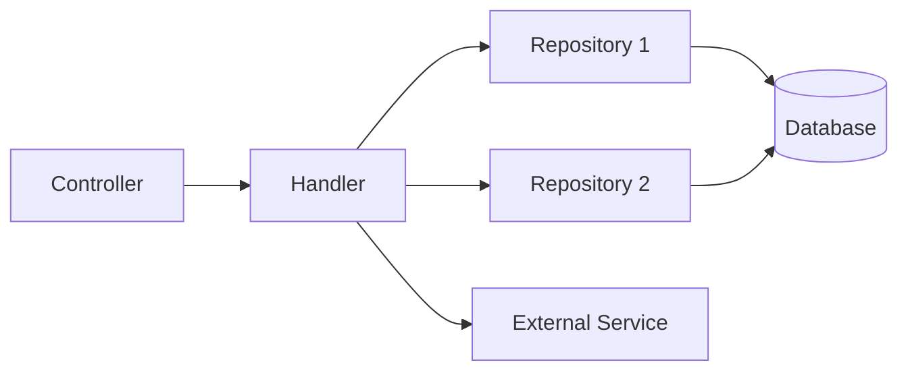

# Handler Skill

## 描述
Handler 業務邏輯層實作技能，協助開發者實作符合專案規範的 Handler，包含業務邏輯處理、流程協調、Result Pattern 錯誤處理等。

## 職責
- 實作核心業務邏輯
- 整合 Repository 進行資料操作
- 使用 Result Pattern 處理錯誤
- 支援 CancellationToken
- 協調跨 Repository 的複雜操作

## 能力

### 1. 業務邏輯實作
- 實作業務規則與驗證
- 流程協調與編排
- 跨 Repository 操作的交易管理

### 2. Result Pattern 整合
- 使用 `Result<TSuccess, TFailure>` 作為回傳類型
- 錯誤封裝與 Failure 物件建立
- 不拋出業務邏輯例外

### 3. 依賴注入
- 使用主建構函式注入
- 注入 Repository、DbContextFactory
- 注入 TraceContext（如需要）

### 4. 非同步程式設計
- 所有 I/O 操作使用 async/await
- 傳遞 CancellationToken
- 避免 .Result 或 .Wait()

## 使用方式

### 在 GitHub Copilot 中使用
```
@workspace 我需要實作 Handler 業務邏輯
```

### 直接呼叫 Skill
```
使用 handler 實作業務邏輯
```

## Handler 架構



## Handler 職責範圍

### ✅ Handler 應該做的事

1. **業務邏輯**
   - 業務規則驗證
   - 資料轉換與映射
   - 流程協調

2. **錯誤處理**
   - 使用 Result Pattern
   - 封裝 Failure 物件
   - 保存原始例外

3. **交易管理**
   - 跨 Repository 的交易協調
   - 確保資料一致性

### ❌ Handler 不應該做的事

1. **HTTP 相關邏輯**
   - 不處理 HTTP 請求/回應
   - 不設定 HTTP 狀態碼
   - 不處理路由

2. **直接資料存取**
   - 不直接操作 DbContext
   - 不撰寫 SQL 查詢
   - 透過 Repository 存取資料

3. **拋出業務例外**
   - 不使用 throw 拋出業務錯誤
   - 使用 Result Pattern 回傳錯誤

## 實作範本

完整範本請參考：`assets/handler-template.cs`

## 核心模式

### 1. Result Pattern

```csharp
public async Task<Result<MemberResponse, Failure>> CreateMemberAsync(
    CreateMemberRequest request,
    CancellationToken cancellationToken = default)
{
    try
    {
        // 業務邏輯
        var member = new Member
        {
            Email = request.Email,
            Name = request.Name
        };

        var createResult = await repository.CreateAsync(member, cancellationToken);

        return createResult.Match(
            success => Result.Success<MemberResponse, Failure>(MapToResponse(success)),
            failure => Result.Failure<MemberResponse, Failure>(failure)
        );
    }
    catch (Exception ex)
    {
        return Result.Failure<MemberResponse, Failure>(new Failure
        {
            Code = nameof(FailureCode.InternalServerError),
            Message = ex.Message,
            TraceId = traceContext.TraceId,
            Exception = ex // 保存原始例外
        });
    }
}
```

### 2. 交易管理

```csharp
public async Task<Result<OrderDetail, Failure>> CreateOrderAsync(
    CreateOrderRequest request,
    CancellationToken cancellationToken = default)
{
    await using var dbContext = await dbContextFactory.CreateDbContextAsync(cancellationToken);
    await using var transaction = await dbContext.Database.BeginTransactionAsync(cancellationToken);

    try
    {
        // 1. 建立訂單
        var orderResult = await orderRepository.CreateAsync(...);
        if (orderResult.IsFailure) return orderResult;

        // 2. 建立訂單明細
        var itemsResult = await orderItemRepository.CreateBatchAsync(...);
        if (itemsResult.IsFailure)
        {
            await transaction.RollbackAsync(cancellationToken);
            return Result.Failure<OrderDetail, Failure>(itemsResult.Error);
        }

        // 3. 更新庫存
        var stockResult = await inventoryRepository.ReduceStockAsync(...);
        if (stockResult.IsFailure)
        {
            await transaction.RollbackAsync(cancellationToken);
            return Result.Failure<OrderDetail, Failure>(stockResult.Error);
        }

        await transaction.CommitAsync(cancellationToken);
        return Result.Success<OrderDetail, Failure>(...);
    }
    catch (Exception ex)
    {
        await transaction.RollbackAsync(cancellationToken);
        return Result.Failure<OrderDetail, Failure>(new Failure { ... });
    }
}
```

## 參考文件
- [Handler 最佳實踐](./references/handler-best-practices.md)

## 範本檔案
- [Handler 實作範本](./assets/handler-template.cs)

## 注意事項

### 🔒 核心原則
1. **Result Pattern 必用**：不拋出業務邏輯例外
2. **保存原始例外**：所有捕捉的例外都寫入 Failure.Exception
3. **CancellationToken**：所有非同步方法都支援
4. **單一職責**：一個 Handler 對應一個功能領域

### 📋 最佳實踐
1. **不記錄錯誤日誌**：由 Middleware 統一記錄
2. **業務驗證優先**：在資料庫操作前先驗證業務規則
3. **交易範圍最小化**：只在必要時使用交易
4. **避免過度設計**：從簡單開始，需要時再重構

### ✅ 成功指標
- [ ] 使用 Result Pattern 回傳
- [ ] 所有例外都封裝到 Failure.Exception
- [ ] 支援 CancellationToken
- [ ] 不包含 HTTP 相關邏輯
- [ ] 透過 Repository 存取資料

## 錯誤處理

### 常見錯誤 1：忘記傳遞 CancellationToken
```csharp
// ❌ 錯誤
await repository.CreateAsync(member);

// ✅ 正確
await repository.CreateAsync(member, cancellationToken);
```

### 常見錯誤 2：拋出業務例外
```csharp
// ❌ 錯誤
if (await repository.EmailExistsAsync(email))
    throw new BusinessException("Email 已存在");

// ✅ 正確
if (await repository.EmailExistsAsync(email, cancellationToken))
    return Result.Failure<MemberResponse, Failure>(new Failure
    {
        Code = nameof(FailureCode.DuplicateEmail),
        Message = "Email 已被註冊",
        TraceId = traceContext.TraceId
    });
```

### 常見錯誤 3：未保存原始例外
```csharp
// ❌ 錯誤
catch (Exception ex)
{
    return Result.Failure<T, Failure>(new Failure
    {
        Code = nameof(FailureCode.InternalServerError),
        Message = ex.Message
        // 缺少 Exception = ex
    });
}

// ✅ 正確
catch (Exception ex)
{
    return Result.Failure<T, Failure>(new Failure
    {
        Code = nameof(FailureCode.InternalServerError),
        Message = ex.Message,
        TraceId = traceContext.TraceId,
        Exception = ex // 保存原始例外
    });
}
```

## 相關 Skills
- `repository-design` - Repository 設計與實作
- `error-handling` - Result Pattern 與錯誤處理
- `api-development` - Controller 整合

## 相關 Agents
- `feature-development-agent` - 使用本 skill 的完整功能開發流程
