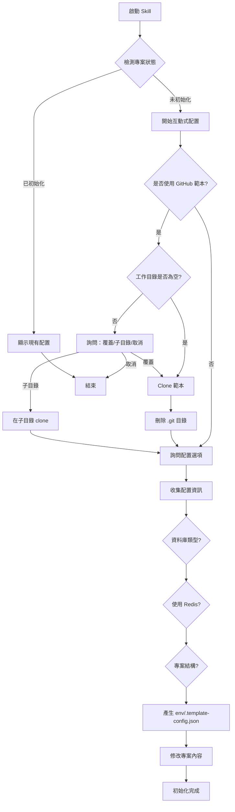

# Project Init Skill

## 描述
專案初始化與配置技能，負責引導使用者完成新專案的初始化、配置設定與 GitHub 範本套用。

## 職責
- 檢測專案狀態（判斷是否為空白專案）
- 引導使用者選擇技術堆疊與配置
- 套用 GitHub 範本（可選）
- 產生專案配置檔案 `env/.template-config.json`

## 能力

### 1. 專案狀態檢測
自動檢測專案是否需要初始化，檢測條件包括：
- `env/.template-config.json` 配置檔案是否存在
- `.sln` 解決方案檔案是否存在
- `src/` 目錄是否存在且非空
- `appsettings.json` 或 `docker-compose.yml` 是否存在

### 2. 互動式配置引導
透過結構化問答引導使用者完成配置：
- 是否使用 GitHub 範本（https://github.com/yaochangyu/api.template）
- 資料庫類型選擇（SQL Server / PostgreSQL / MySQL）
- Redis 快取需求（是否使用 Redis）
- 專案結構組織（單一專案 / 多專案）

### 3. GitHub 範本套用
如果使用者選擇使用 GitHub 範本：
- 安全檢查：確認工作目錄為空或使用者同意覆蓋
- 執行 `git clone https://github.com/yaochangyu/api.template .`
- 刪除 `.git/` 目錄（移除 Git 歷史與遠端設定）
- 根據使用者配置修改專案內容

### 4. 配置檔案產生
根據使用者選擇，產生 `env/.template-config.json` 配置檔案。

## 使用方式

### 在 GitHub Copilot 中使用
```
@workspace 我想要初始化一個新的 ASP.NET Core Web API 專案
```

### 直接呼叫 Skill
```
使用 project-init 初始化專案
```

## 互動流程



## 互動問答範例

### 問題 1：是否使用 GitHub 範本
```
是否要使用官方範本快速啟動專案？

1️⃣ 是，使用 GitHub 範本（推薦）
   - 從 https://github.com/yaochangyu/api.template clone 完整專案結構
   - 包含最佳實踐範例程式碼
   - 已配置好 Docker、測試環境等基礎設施

2️⃣ 否，從空白專案開始
   - 僅產生必要的配置檔案
   - 自行建立專案結構
```

### 問題 2：資料庫類型選擇
```
請選擇資料庫類型：

1️⃣ SQL Server（推薦）
   - 微軟官方支援
   - 適合 Windows 環境
   - 範本預設使用版本：2022

2️⃣ PostgreSQL
   - 開源免費
   - 跨平台支援佳
   - 適合 Linux/Docker 環境

3️⃣ MySQL
   - 開源免費
   - 廣泛使用
   - 社群資源豐富
```

### 問題 3：Redis 快取需求
```
是否需要使用 Redis 分散式快取？

1️⃣ 是，使用 Redis（推薦用於生產環境）
   - 支援多實例共用快取
   - 提供分散式快取能力
   - 範本預設版本：7-alpine

2️⃣ 否，僅使用記憶體內快取
   - 適合開發環境或單一實例
   - 簡單快速
   - 應用程式重啟後快取清空
```

### 問題 4：專案結構組織
```
請選擇專案結構組織方式：

1️⃣ 單一專案結構（推薦用於小型團隊）
   - Controller、Handler、Repository 都在 WebAPI 專案內
   - 編譯快速、部署簡單
   - 適合：3 人以下團隊、快速開發

2️⃣ 多專案結構（推薦用於大型團隊）
   - Controller、Handler、Repository 各自獨立專案
   - 職責清晰分離、便於團隊協作
   - 適合：大型團隊、明確分工、長期維護
```

## 產生的配置檔案範例

### env/.template-config.json
```json
{
  "database": {
    "type": "SQL Server",
    "version": "2022",
    "useEfCore": true
  },
  "cache": {
    "useRedis": true,
    "version": "7-alpine"
  },
  "projectOrganization": "single-project",
  "createdAt": "2026-01-03T10:00:00.000Z",
  "createdBy": "GitHub Copilot - project-init"
}
```

## 參考文件
- [專案初始化詳細規範](./references/project-initialization.md)

## 注意事項

### 🔒 安全原則
1. **不得擅自覆蓋**：僅在工作目錄為空或使用者明確同意時執行 clone
2. **確認再執行**：所有有風險的操作都必須先詢問使用者
3. **清楚說明**：每個選項都要說明影響與適用場景

### 📋 遵循規範
1. **強制互動**：不得擅自使用預設值，必須明確詢問
2. **分階段互動**：每次最多 3-4 個問題，避免資訊過載
3. **完整性優先**：收集所有必要資訊後才開始執行

### ✅ 成功指標
- [ ] 成功產生 `env/.template-config.json` 配置檔案
- [ ] 如使用範本，專案結構完整且 `.git/` 已移除
- [ ] 配置內容符合使用者選擇
- [ ] 專案可正常建置（如使用範本）

## 錯誤處理

### 工作目錄非空
```
⚠️ 警告：工作目錄非空

當前目錄包含以下檔案/資料夾：
- src/
- .git/
- README.md

請選擇：
1️⃣ 改用子資料夾（建立 api-project/ 目錄）
2️⃣ 清空目錄後重試（風險高，需再次確認）
3️⃣ 取消操作
```

### Git clone 失敗
```
❌ 錯誤：無法 clone GitHub 範本

可能原因：
- 網路連線問題
- Git 未安裝或未設定
- 權限不足

建議：
1. 檢查網路連線
2. 確認已安裝 Git：git --version
3. 手動執行：git clone https://github.com/yaochangyu/api.template .
```

## 相關 Skills
- `api-development` - 後續 API 開發流程
- `bdd-testing` - 測試環境設定

## 相關 Agents
- `project-setup-agent` - 使用本 skill 的專案設定代理
