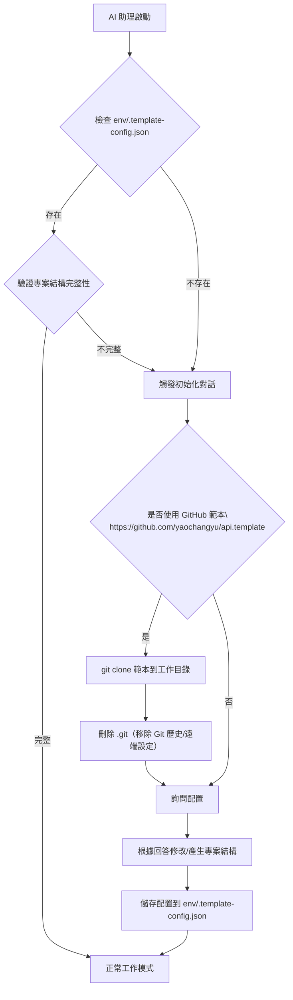

# 專案初始化詳細規範

本文件詳細說明 ASP.NET Core Web API 專案的初始化流程、檢測機制與配置規範。

## 專案狀態檢測機制

### 檢測目的
在 AI 助理首次接觸專案時，必須優先檢測專案狀態，判斷是否需要執行初始化流程。

### 檢測條件

專案滿足以下**任一條件**即視為「空白專案」，需要執行初始化：

1. **不存在** `env/.template-config.json` 配置檔案
2. **不存在** `.sln` 解決方案檔案
3. **不存在** `src/` 目錄或該目錄為空
4. **不存在** `appsettings.json` 或 `docker-compose.yml`

### 檢測流程圖



### 檢測實作範例（偽代碼）

```typescript
async function detectProjectStatus(): Promise<'initialized' | 'blank'> {
  // 檢查 1: 配置檔案
  const hasConfig = await fileExists('env/.template-config.json');
  if (!hasConfig) return 'blank';

  // 檢查 2: 解決方案檔案
  const hasSolution = await fileExists('*.sln');
  if (!hasSolution) return 'blank';

  // 檢查 3: src 目錄
  const hasSrcDir = await directoryExists('src') && await isDirectoryNotEmpty('src');
  if (!hasSrcDir) return 'blank';

  // 檢查 4: appsettings.json 或 docker-compose.yml
  const hasAppSettings = await fileExists('**/appsettings.json');
  const hasDockerCompose = await fileExists('docker-compose.yml');
  if (!hasAppSettings && !hasDockerCompose) return 'blank';

  // 驗證專案結構完整性
  const isComplete = await validateProjectStructure();
  return isComplete ? 'initialized' : 'blank';
}
```

## GitHub 範本套用規則

### 範本位置
- **官方範本 URL**：https://github.com/yaochangyu/api.template
- **用途**：提供完整的專案結構、最佳實踐範例程式碼與配置

### 套用時機
當專案狀態檢測判定為「空白專案」時，初始化對話的**第一個問題**必須詢問是否使用 GitHub 範本。

### 安全檢查原則（關鍵）

**🔒 不得擅自覆蓋**

1. **僅在以下情況才可執行 clone**：
   - 工作目錄為空
   - 使用者已明確同意覆蓋/清空

2. **若工作目錄非空**：
   - 必須先詢問使用者：「改用子資料夾」或「取消」
   - 不可擅自清空或覆蓋現有檔案

### 套用流程

#### 步驟 1：安全檢查
```powershell
# 檢查工作目錄是否為空
$items = Get-ChildItem -Path . -Force
if ($items.Count -gt 0) {
    # 目錄非空，詢問使用者
    Write-Host "⚠️ 工作目錄非空，包含 $($items.Count) 個項目"
    # 顯示選項：改用子資料夾 / 取消
}
```

#### 步驟 2：Clone 範本
```powershell
# Windows PowerShell 範例（在空目錄中）
git clone https://github.com/yaochangyu/api.template .
```

**注意**：命令最後的 `.` 表示 clone 到當前目錄，不建立子資料夾。

#### 步驟 3：刪除 Git 相關資料
```powershell
# Windows PowerShell 範例
Remove-Item -Recurse -Force .git
```

**為什麼要刪除 `.git/`**：
- 移除原範本的 Git 歷史記錄
- 移除遠端倉庫設定（避免誤 push 到範本倉庫）
- 讓使用者可以初始化自己的 Git 倉庫

#### 步驟 4：進入互動式配置
接著進入本專案的互動式配置流程（資料庫/快取/專案結構等）。

### 完整範例腳本

```powershell
# 專案初始化腳本（Windows PowerShell）

# 1. 檢查目錄
$currentDir = Get-Location
$items = Get-ChildItem -Path $currentDir -Force

if ($items.Count -gt 0) {
    Write-Host "⚠️ 當前目錄非空，包含以下項目："
    $items | ForEach-Object { Write-Host "  - $($_.Name)" }

    $choice = Read-Host "請選擇：(1) 改用子資料夾 (2) 取消"

    if ($choice -eq "1") {
        $subDir = "api-project"
        New-Item -ItemType Directory -Path $subDir
        Set-Location $subDir
        Write-Host "✅ 已建立並切換到子資料夾: $subDir"
    } else {
        Write-Host "❌ 操作已取消"
        exit
    }
}

# 2. Clone 範本
Write-Host "📥 正在 clone GitHub 範本..."
git clone https://github.com/yaochangyu/api.template .

if ($LASTEXITCODE -ne 0) {
    Write-Host "❌ Clone 失敗，請檢查網路連線與 Git 安裝"
    exit
}

# 3. 刪除 .git 目錄
Write-Host "🗑️ 正在移除 Git 歷史..."
Remove-Item -Recurse -Force .git

Write-Host "✅ GitHub 範本套用完成"
Write-Host "📋 接下來將進入互動式配置..."
```

## 配置檔案格式

### 檔案位置
`env/.template-config.json`

### 檔案用途
- 記錄專案初始化時的配置選擇
- 供 AI 助理判斷專案狀態與技術堆疊
- 避免重複詢問已配置的項目

### JSON Schema

```json
{
  "$schema": "http://json-schema.org/draft-07/schema#",
  "type": "object",
  "required": ["database", "cache", "projectOrganization", "createdAt", "createdBy"],
  "properties": {
    "database": {
      "type": "object",
      "required": ["type", "version", "useEfCore"],
      "properties": {
        "type": {
          "type": "string",
          "enum": ["SQL Server", "PostgreSQL", "MySQL"]
        },
        "version": {
          "type": "string",
          "description": "資料庫版本，例如：2022、15、8.0"
        },
        "useEfCore": {
          "type": "boolean",
          "description": "是否使用 Entity Framework Core"
        }
      }
    },
    "cache": {
      "type": "object",
      "required": ["useRedis"],
      "properties": {
        "useRedis": {
          "type": "boolean",
          "description": "是否使用 Redis 分散式快取"
        },
        "version": {
          "type": "string",
          "description": "Redis 版本（僅在 useRedis=true 時存在），例如：7-alpine"
        }
      }
    },
    "projectOrganization": {
      "type": "string",
      "enum": ["single-project", "multi-project"],
      "description": "專案組織方式"
    },
    "createdAt": {
      "type": "string",
      "format": "date-time",
      "description": "配置建立時間（ISO 8601 格式）"
    },
    "createdBy": {
      "type": "string",
      "description": "建立者（例如：Claude CLI、GitHub Copilot）"
    }
  }
}
```

### 完整範例

```json
{
  "database": {
    "type": "SQL Server",
    "version": "2022",
    "useEfCore": true
  },
  "cache": {
    "useRedis": true,
    "version": "7-alpine"
  },
  "projectOrganization": "single-project",
  "createdAt": "2026-01-03T10:30:00.000Z",
  "createdBy": "GitHub Copilot - project-init"
}
```

### 範例解讀

| 欄位 | 值 | 說明 |
|------|-----|------|
| `database.type` | `"SQL Server"` | 使用 SQL Server 資料庫 |
| `database.version` | `"2022"` | SQL Server 2022 版本 |
| `database.useEfCore` | `true` | 使用 Entity Framework Core ORM |
| `cache.useRedis` | `true` | 使用 Redis 分散式快取 |
| `cache.version` | `"7-alpine"` | Redis 7 Alpine 映像 |
| `projectOrganization` | `"single-project"` | 單一專案結構 |
| `createdAt` | ISO 8601 時間 | 配置建立時間 |
| `createdBy` | 工具名稱 | 建立此配置的 AI 工具 |

## 強制詢問情境

### 原則
根據 CLAUDE.md 的「核心互動原則」，以下情境**必須明確詢問**使用者，不得擅自使用預設值。

### 1. 是否使用 GitHub 範本

**問題**：
```
是否要使用官方範本快速啟動專案？

1️⃣ 是，使用 GitHub 範本（推薦）
2️⃣ 否，從空白專案開始
```

**選項說明**：
- **選項 1**：適合快速啟動、學習最佳實踐、團隊協作
- **選項 2**：適合完全客製化、學習專案結構、特殊需求

**不得假設**：即使「推薦」使用範本，仍須明確詢問。

### 2. 資料庫類型選擇

**問題**：
```
請選擇資料庫類型：

1️⃣ SQL Server（推薦）
2️⃣ PostgreSQL
3️⃣ MySQL
```

**選項說明**：
- **SQL Server**：微軟官方支援、適合 Windows 環境、範本預設
- **PostgreSQL**：開源免費、跨平台、適合 Linux/Docker
- **MySQL**：開源免費、廣泛使用、社群資源豐富

**額外詢問**（選擇後）：
```
請指定資料庫版本：
- SQL Server: 2022（推薦）/ 2019 / 2017
- PostgreSQL: 15（推薦）/ 14 / 13
- MySQL: 8.0（推薦）/ 5.7
```

### 3. Redis 快取需求

**問題**：
```
是否需要使用 Redis 分散式快取？

1️⃣ 是，使用 Redis（推薦用於生產環境）
2️⃣ 否，僅使用記憶體內快取
```

**選項說明**：
- **選項 1**：支援多實例、分散式快取、適合生產環境
- **選項 2**：簡單快速、適合開發環境、單一實例

**額外詢問**（選擇「是」後）：
```
請指定 Redis 版本：
- 7-alpine（推薦，最新穩定版）
- 6-alpine
```

### 4. 專案結構組織

**問題**：
```
請選擇專案結構組織方式：

1️⃣ 單一專案結構（推薦用於小型團隊）
2️⃣ 多專案結構（推薦用於大型團隊）
```

**選項說明**：
- **單一專案**：
  - Controller、Handler、Repository 都在 WebAPI 專案內
  - 編譯快速、部署簡單
  - 適合：3 人以下團隊、快速開發

- **多專案**：
  - Controller、Handler、Repository 各自獨立專案
  - 職責清晰分離、便於團隊協作
  - 適合：大型團隊、明確分工、長期維護

## 互動流程範例

### 完整對話範例

```
AI: 偵測到這是一個新專案，需要進行初始化設定。

AI: 【問題 1/4】是否要使用官方範本快速啟動專案？

    1️⃣ 是，使用 GitHub 範本（推薦）
       - 從 https://github.com/yaochangyu/api.template clone 完整專案結構
       - 包含最佳實踐範例程式碼
       - 已配置好 Docker、測試環境等基礎設施

    2️⃣ 否，從空白專案開始
       - 僅產生必要的配置檔案
       - 自行建立專案結構

使用者: 1

AI: ✅ 將使用 GitHub 範本

AI: 【問題 2/4】請選擇資料庫類型：

    1️⃣ SQL Server（推薦）
       - 微軟官方支援
       - 適合 Windows 環境
       - 範本預設使用版本：2022

    2️⃣ PostgreSQL
       - 開源免費
       - 跨平台支援佳
       - 適合 Linux/Docker 環境

    3️⃣ MySQL
       - 開源免費
       - 廣泛使用
       - 社群資源豐富

使用者: 1

AI: ✅ 已選擇 SQL Server 2022

AI: 【問題 3/4】是否需要使用 Redis 分散式快取？

    1️⃣ 是，使用 Redis（推薦用於生產環境）
       - 支援多實例共用快取
       - 提供分散式快取能力
       - 範本預設版本：7-alpine

    2️⃣ 否，僅使用記憶體內快取
       - 適合開發環境或單一實例
       - 簡單快速
       - 應用程式重啟後快取清空

使用者: 1

AI: ✅ 已選擇 Redis 7-alpine

AI: 【問題 4/4】請選擇專案結構組織方式：

    1️⃣ 單一專案結構（推薦用於小型團隊）
       - Controller、Handler、Repository 都在 WebAPI 專案內
       - 編譯快速、部署簡單
       - 適合：3 人以下團隊、快速開發

    2️⃣ 多專案結構（推薦用於大型團隊）
       - Controller、Handler、Repository 各自獨立專案
       - 職責清晰分離、便於團隊協作
       - 適合：大型團隊、明確分工、長期維護

使用者: 1

AI: ✅ 已選擇單一專案結構

AI: 📋 配置摘要：
    - GitHub 範本：是
    - 資料庫：SQL Server 2022
    - 快取：Redis 7-alpine
    - 專案結構：單一專案

AI: 開始執行初始化...

AI: 📥 正在 clone GitHub 範本...
    ✅ Clone 完成

AI: 🗑️ 正在移除 Git 歷史...
    ✅ .git/ 目錄已刪除

AI: 💾 正在產生配置檔案...
    ✅ env/.template-config.json 已建立

AI: 🎉 專案初始化完成！

AI: 📖 下一步建議：
    1. 執行 `task build` 建置專案
    2. 執行 `task api-dev` 啟動開發伺服器
    3. 瀏覽 http://localhost:5000/scalar 查看 API 文件
```

## 分階段互動原則

### 原則說明
根據 CLAUDE.md：
- 單次詢問最多 3-4 個問題
- 複雜流程應分階段進行
- 根據前一階段的回答決定後續問題

### 階段劃分範例

#### 階段 1：基礎選擇（2 個問題）
1. 是否使用 GitHub 範本？
2. 資料庫類型選擇？

#### 階段 2：進階配置（2 個問題）
3. Redis 快取需求？
4. 專案結構組織？

#### 階段 3：確認與執行
5. 顯示配置摘要
6. 詢問是否確認執行
7. 執行初始化

## 錯誤處理與復原

### 常見錯誤情境

#### 1. 工作目錄非空
**錯誤訊息**：
```
⚠️ 警告：工作目錄非空

當前目錄包含以下檔案/資料夾：
- src/
- .git/
- README.md
```

**處理方式**：
```
請選擇：
1️⃣ 改用子資料夾（建立 api-project/ 目錄）
2️⃣ 取消操作

⚠️ 不建議：清空目錄（風險高）
```

#### 2. Git Clone 失敗
**錯誤訊息**：
```
❌ 錯誤：無法 clone GitHub 範本

執行命令：git clone https://github.com/yaochangyu/api.template .
錯誤代碼：128
```

**可能原因與解決方案**：
```
可能原因：
1. 網路連線問題
   → 檢查網路連線，嘗試訪問 github.com

2. Git 未安裝或未設定
   → 執行：git --version
   → 若未安裝，請安裝 Git：https://git-scm.com/

3. 權限不足
   → 確認對當前目錄有寫入權限

4. 代理或防火牆阻擋
   → 檢查公司網路設定
   → 嘗試使用 HTTPS 代理

建議：
- 手動執行：git clone https://github.com/yaochangyu/api.template .
- 或下載 ZIP：https://github.com/yaochangyu/api.template/archive/refs/heads/main.zip
```

#### 3. 無法建立配置檔案
**錯誤訊息**：
```
❌ 錯誤：無法建立 env/.template-config.json

錯誤：ENOENT: no such file or directory
```

**處理方式**：
```
正在建立 env/ 目錄...
✅ 目錄已建立
正在重試寫入配置檔案...
✅ 配置檔案已成功建立
```

### 復原機制

#### 回滾策略
若初始化過程失敗，提供回滾選項：

```
❌ 初始化失敗

已完成的步驟：
✅ Clone 範本
✅ 刪除 .git/
❌ 產生配置檔案（失敗）

是否要回滾已執行的步驟？
1️⃣ 是，刪除已 clone 的檔案
2️⃣ 否，保留現有檔案，我會手動處理
```

## 驗證與測試

### 初始化成功驗證清單

- [ ] `env/.template-config.json` 檔案存在且格式正確
- [ ] JSON 內容符合 Schema 定義
- [ ] 所有必要欄位都已填寫
- [ ] 如使用範本：`.git/` 目錄已被刪除
- [ ] 如使用範本：專案結構完整（src/, doc/, docker-compose.yml 等）
- [ ] 如使用範本：可成功執行 `task build`

### 單元測試範例（偽代碼）

```typescript
describe('Project Initialization', () => {
  test('應正確檢測空白專案', async () => {
    const status = await detectProjectStatus();
    expect(status).toBe('blank');
  });

  test('應正確產生配置檔案', async () => {
    const config = {
      database: { type: 'SQL Server', version: '2022', useEfCore: true },
      cache: { useRedis: true, version: '7-alpine' },
      projectOrganization: 'single-project',
      createdAt: new Date().toISOString(),
      createdBy: 'Test'
    };

    await saveConfig(config);

    const saved = await loadConfig();
    expect(saved).toEqual(config);
  });

  test('應在目錄非空時提示使用者', async () => {
    // 模擬非空目錄
    await createFile('test.txt');

    const result = await initializeProject({ useTemplate: true });

    expect(result.error).toBe('DIRECTORY_NOT_EMPTY');
    expect(result.requiresUserInput).toBe(true);
  });
});
```

## 最佳實踐建議

### 1. 互動設計
- ✅ 使用結構化編號（1️⃣ 2️⃣ 3️⃣）提升可讀性
- ✅ 每個選項都要有清楚的說明
- ✅ 標示推薦選項，但不強制使用
- ✅ 顯示配置摘要供使用者確認

### 2. 錯誤處理
- ✅ 提供明確的錯誤訊息與原因分析
- ✅ 給出可行的解決方案
- ✅ 提供復原選項
- ✅ 記錄錯誤日誌供偵錯

### 3. 使用者體驗
- ✅ 顯示進度指示（例如：【問題 1/4】）
- ✅ 執行長時間操作時顯示即時狀態
- ✅ 完成後提供下一步建議
- ✅ 保持簡潔，避免資訊過載

## 參考資源

- [CLAUDE.md - AI 助理使用規則](../../../CLAUDE.md#ai-助理使用規則)
- [CLAUDE.md - 專案狀態檢測機制](../../../CLAUDE.md#專案狀態檢測機制)
- [GitHub 範本倉庫](https://github.com/yaochangyu/api.template)
