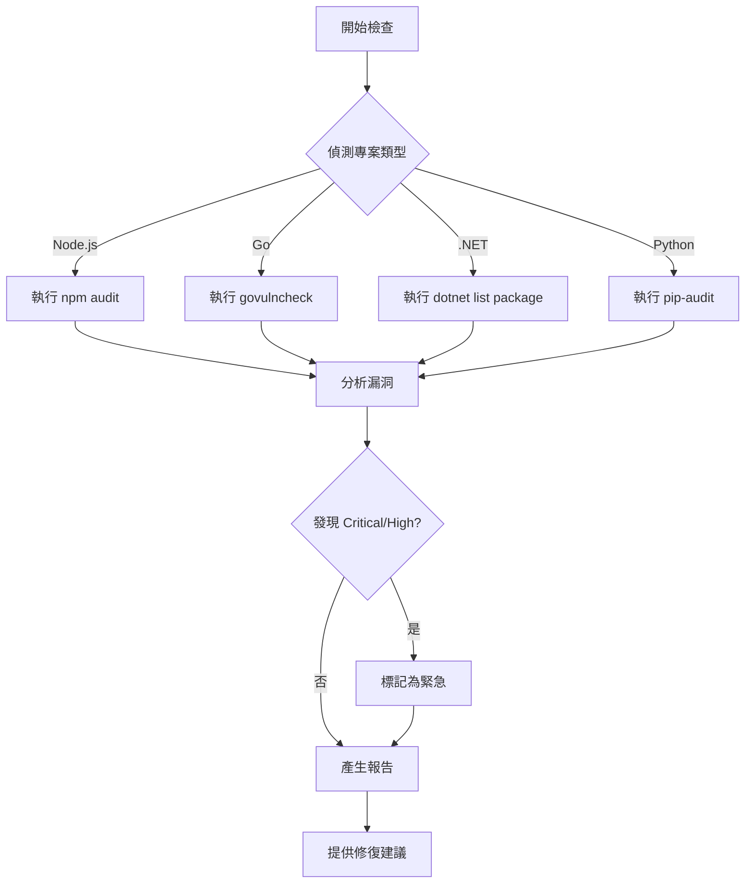

# Security Check Dependencies

依賴套件安全檢查工具，掃描專案依賴套件的已知漏洞。

## 📋 概述

**檢查範圍**：npm、Go modules、.NET packages、Python packages  
**檢查方法**：官方工具整合（npm audit、govulncheck 等）  
**更新頻率**：建議每週檢查

## 🎯 支援的專案類型

### Node.js / JavaScript
- 工具：`npm audit`、`pnpm audit`、`yarn audit`
- 資料來源：GitHub Advisory Database
- 檢查：package.json、package-lock.json

### Go
- 工具：`govulncheck`
- 資料來源：Go Vulnerability Database
- 檢查：go.mod、go.sum

### .NET
- 工具：`dotnet list package --vulnerable`
- 資料來源：NuGet Advisory Database
- 檢查：*.csproj、packages.config

### Python
- 工具：`pip-audit`、`safety`
- 資料來源：PyPI Advisory Database
- 檢查：requirements.txt、Pipfile

## 🚀 使用方式

### 全專案檢查
```bash
@workspace 使用 security-check-dependencies 檢查所有依賴套件
```

### 指定專案類型
```bash
@workspace 使用 security-check-dependencies 檢查 Node.js 依賴套件
```

### 只顯示高風險
```bash
@workspace 使用 security-check-dependencies 檢查 Critical 和 High 級別的漏洞
```

## 📊 報告格式

```
📦 依賴套件安全檢查報告
==========================================
檢查時間: 2026-01-09 16:20:00
專案類型: Node.js

📊 統計資訊
━━━━━━━━━━━━━━━━━━━━━━━━━━━━━━━━━━━━━━━━
總依賴套件: 234
有漏洞套件: 8
🔴 Critical: 2
🟠 High: 3
🟡 Medium: 2
🔵 Low: 1

⚠️ 發現的漏洞
━━━━━━━━━━━━━━━━━━━━━━━━━━━━━━━━━━━━━━━━

🔴 [CVE-2024-12345] axios - SSRF Vulnerability
━━━━━━━━━━━━━━━━━━━━━━━━━━━━━━━━━━━━━━━━
當前版本: 0.21.1
安全版本: ≥ 1.6.0
嚴重程度: Critical
CVSS 分數: 9.8

問題描述:
axios 0.21.1 存在 SSRF 漏洞，攻擊者可以透過特製的 URL
導致伺服器向內部網路發送請求。

修復建議:
npm install axios@latest

參考連結:
- https://nvd.nist.gov/vuln/detail/CVE-2024-12345
- https://github.com/advisories/GHSA-xxxx-xxxx-xxxx

✅ 更新建議
━━━━━━━━━━━━━━━━━━━━━━━━━━━━━━━━━━━━━━━━
# 更新所有套件
npm audit fix

# 強制更新（包含 breaking changes）
npm audit fix --force

# 僅更新特定套件
npm install axios@latest
```

## ⏰ 使用時機

### ✅ 適合使用
- ✅ 定期安全檢查（每週）
- ✅ 新增依賴套件後
- ✅ 依賴套件更新前
- ✅ 發布前檢查
- ✅ 安全稽核準備

### 🔄 建議頻率
- 開發期間：每週一次
- 新增套件：立即檢查
- 重要更新：更新前後各一次
- CI/CD：每次建置

## 🎯 檢查流程



## 🔧 自動修復

### Node.js
```bash
# 自動修復（不會造成 breaking changes）
npm audit fix

# 強制修復（可能有 breaking changes）
npm audit fix --force

# 僅檢視，不執行
npm audit --dry-run
```

### Go
```bash
# 更新到安全版本
go get -u [package]@latest
go mod tidy
```

### .NET
```bash
# 更新套件
dotnet add package [PackageName] --version [SafeVersion]
```

## 🤖 自動化建議

### Dependabot 配置
```yaml
# .github/dependabot.yml
version: 2
updates:
  - package-ecosystem: "npm"
    directory: "/"
    schedule:
      interval: "weekly"
    open-pull-requests-limit: 10
```

### GitHub Actions
```yaml
# .github/workflows/security-check.yml
name: Security Check
on:
  schedule:
    - cron: '0 0 * * 1'  # 每週一
  push:
    branches: [main]

jobs:
  dependency-check:
    runs-on: ubuntu-latest
    steps:
      - uses: actions/checkout@v3
      - uses: actions/setup-node@v3
      - run: npm audit --audit-level=high
```

## 🔗 相關 Skills

- **security-fast-scan** - 快速安全掃描
- **security-check-config** - 安全配置檢查
- **security-deep-review** - 程式碼安全深度審查

## 💡 最佳實踐

### 1. 定期更新
```bash
# 每週執行
@workspace 使用 security-check-dependencies 檢查並更新依賴套件
```

### 2. 版本管理
- 使用 Lock 檔案（package-lock.json、go.sum）
- 避免使用 `*` 或 `latest` 版本
- 使用語意化版本（Semantic Versioning）

### 3. 風險評估
- Critical/High：立即更新
- Medium：一週內更新
- Low：下次更新時處理

### 4. 測試驗證
- 更新後執行完整測試
- 檢查 breaking changes
- 驗證功能正常

## 📈 追蹤指標

- [ ] 無 Critical 級別漏洞
- [ ] High 級別漏洞 < 5 個
- [ ] 過時套件比例 < 10%
- [ ] 所有依賴套件在支援週期內

## 📚 參考資源

- [OWASP Dependency-Check](https://owasp.org/www-project-dependency-check/)
- [GitHub Advisory Database](https://github.com/advisories)
- [Snyk Vulnerability Database](https://security.snyk.io/)
- [npm audit 文件](https://docs.npmjs.com/cli/v8/commands/npm-audit)
- [govulncheck 文件](https://pkg.go.dev/golang.org/x/vuln/cmd/govulncheck)
- [完整文件](./SKILL.md)
- [安全報告範本](../templates/security-report-template.md)
