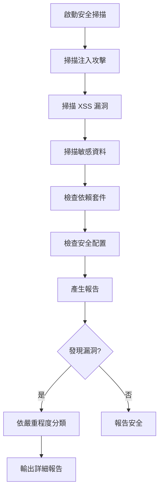

# Security Fast Scan

## 描述
執行全面的應用程式安全掃描，整合所有安全檢查項目，識別潛在的安全漏洞與風險。

## 職責
- 掃描注入攻擊漏洞（SQL Injection、Command Injection）
- 檢測 XSS 漏洞風險
- 識別敏感資料洩漏（API Keys、Passwords）
- 檢查依賴套件漏洞
- 驗證安全配置問題

## 能力

### 1. 注入攻擊掃描
使用 Grep 工具搜尋以下模式：

**SQL Injection**：
- 搜尋: `\$\{.*\}.*SELECT|INSERT|UPDATE|DELETE` (範本字串中的 SQL)
- 搜尋: `\+.*SELECT|INSERT|UPDATE|DELETE` (字串拼接的 SQL)
- 搜尋: `fmt\.Sprintf.*SELECT|INSERT|UPDATE|DELETE` (Go 的字串格式化)

**Command Injection**：
- 搜尋: `exec\(|execSync\(|spawn\(.*sh.*-c`
- 搜尋: `eval\(`
- 搜尋: `exec\.Command.*sh.*-c`

### 2. XSS 漏洞掃描
- 搜尋: `dangerouslySetInnerHTML`
- 搜尋: `\.innerHTML\s*=`
- 搜尋: `document\.write\(`

### 3. 敏感資料掃描
- 搜尋: `AKIA[0-9A-Z]{16}` (AWS Access Key)
- 搜尋: `sk-[a-zA-Z0-9]{48}` (OpenAI API Key)
- 搜尋: `password\s*[:=]\s*["'][^"']{6,}["']`
- 搜尋: `api[_-]?key\s*[:=]\s*["'][^"']+["']`

### 4. 依賴套件檢查

**Node.js 專案**：
```bash
cd [專案目錄]
npm audit --json
```

**Go 專案**：
```bash
cd [專案目錄]
govulncheck ./...
```

**.NET 專案**：
```bash
cd [專案目錄]
dotnet list package --vulnerable
```

### 5. 安全配置檢查
掃描配置檔中的問題：
- 搜尋: `Access-Control-Allow-Origin.*\*` (CORS 配置)
- 搜尋: `httpOnly.*false|secure.*false` (Cookie 配置)
- 搜尋: `DEBUG.*true|debug.*true` (Debug mode)

## 使用方式

### 在 GitHub Copilot 中使用
```
@workspace 執行安全掃描
```

### 指定掃描路徑
```
使用 security-scan 掃描 src/WebAPI 目錄
```

## 執行流程



## 何時使用

**開發階段**：
- Pull Request 提交前
- 新功能開發完成後
- 重構程式碼後

**定期檢查**：
- 每週安全審查
- 每月完整掃描

**發布前**：
- 重大版本發布前
- 生產環境部署前

## 報告格式

```
🔒 安全掃描報告
==========================================
掃描時間: [時間]
掃描目標: [路徑]

📊 統計資訊
🔴 嚴重 (Critical): [數量]
🟠 高 (High): [數量]
🟡 中 (Medium): [數量]
🔵 低 (Low): [數量]

⚠️ 發現的漏洞
━━━━━━━━━━━━━━━━━━━━━━━━━━━━━━━━━━━━━━━━

🔴 Critical
[詳細列表]

🟠 High
[詳細列表]

🟡 Medium
[詳細列表]

🔵 Low
[詳細列表]

✅ 建議修復步驟
━━━━━━━━━━━━━━━━━━━━━━━━━━━━━━━━━━━━━━━━
[具體建議]
```

## 嚴重程度分類

### 🔴 Critical（嚴重）
- 硬編碼的 API Keys、密碼
- SQL Injection 漏洞
- Command Injection 漏洞
- 可直接導致系統被完全入侵

**修復優先級**：立即修復

### 🟠 High（高）
- XSS 漏洞
- 已知的高風險依賴套件漏洞
- 不安全的 CORS 配置
- 可能導致重大安全事件

**修復優先級**：本週內修復

### 🟡 Medium（中）
- 中等風險依賴套件漏洞
- 不安全的 Cookie 配置
- 有安全風險但需要特定條件

**修復優先級**：兩週內修復

### 🔵 Low（低）
- 低風險依賴套件漏洞
- 安全最佳實踐建議
- 安全影響有限

**修復優先級**：下次重構時處理

## 參數

**target_path**（可選）：
- 要掃描的目錄路徑
- 預設為當前目錄
- 範例：`src/WebAPI`

## 注意事項

### 🔒 核心原則
1. **零容忍敏感資料**：任何硬編碼的密鑰、密碼必須立即移除
2. **依賴套件定期更新**：定期檢查並更新有漏洞的套件
3. **配置檔分離**：敏感配置使用環境變數或 Secret Manager

### 📋 最佳實踐
1. **定期掃描**：整合到 CI/CD 流程中
2. **漏洞追蹤**：建立漏洞追蹤清單並定期審查
3. **安全培訓**：提升團隊安全意識

### ✅ 成功指標
- [ ] 無 Critical 和 High 等級漏洞
- [ ] 所有依賴套件已更新到安全版本
- [ ] 無硬編碼的敏感資料
- [ ] 安全配置符合最佳實踐

## 常見問題

### Q: 掃描需要多久時間？
A: 依專案大小而定，通常 1-5 分鐘

### Q: 可以自動修復漏洞嗎？
A: 部分可以（如依賴套件更新），但多數需要人工審查與修復

### Q: 如何減少誤報？
A: 建立排除清單，並結合人工審查確認

## 報告範本

產生完整安全掃描報告時，請參考：
- `../templates/security-report-template.md` - 詳細的安全檢查報告範本

範本包含：
- 執行摘要與統計
- 問題分類（Critical/High/Medium/Low）
- 詳細發現與修復建議
- 依賴套件漏洞清單
- 安全配置檢查
- OWASP Top 10 合規性
- 修復優先級排程

## 參考資料

### 安全標準
- [OWASP Top 10](https://owasp.org/www-project-top-ten/)
- [CWE Top 25](https://cwe.mitre.org/top25/)

### 工具文件
- [npm audit](https://docs.npmjs.com/cli/v8/commands/npm-audit)
- [govulncheck](https://pkg.go.dev/golang.org/x/vuln/cmd/govulncheck)
- [dotnet list package](https://learn.microsoft.com/en-us/dotnet/core/tools/dotnet-list-package)

## 相關 Skills
- `error-handling` - 安全的錯誤處理模式
- `api-development` - API 安全設計
- `security-check-secrets` - 敏感資料掃描
- `security-check-dependencies` - 依賴套件檢查
- `security-check-config` - 安全配置檢查
- `security-deep-review` - 程式碼安全審查

## 相關 Agents
- `api-security-specialist` - 使用本 skill 進行安全審查
