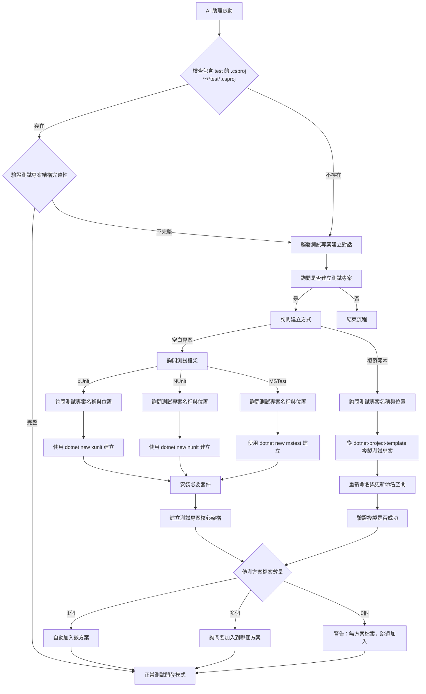
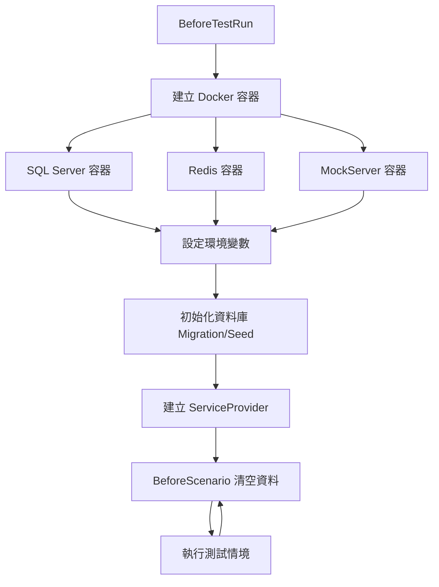
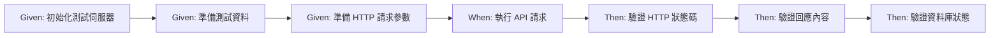

# Web API Testing Skill

## 描述
Web API 測試實作技能,協助開發者使用 Testcontainers + Reqnroll 撰寫完整的 API 整合測試,包含 Docker 測試環境、BDD 情境定義與測試步驟實作。

## 職責
- Web API 整合測試架構設計
- Docker 測試環境設定(Testcontainers)
- Gherkin .feature 檔案撰寫
- 測試步驟實作(Step Definitions)
- WebApplicationFactory 測試伺服器配置
- 外部 API 模擬(MockServer)

## 使用方式

### 在 GitHub Copilot 中使用
```
@workspace 我想要實作 Web API 測試
```

### 直接呼叫 Skill
```
使用 webapi-testing 撰寫 API 測試
```

## 測試專案檢測機制

### 檢測流程

當使用者要求實作 Web API 測試時，**必須優先檢測測試專案狀態**：

#### 檢測條件（滿足以下任一條件視為不存在測試專案）

1. **不存在**包含 "test" 關鍵字（不分大小寫）的 `.csproj` 專案檔案
   - 匹配模式：`**/*[Tt]est*.csproj`
   - 例如：`*.Test.csproj`, `*.Tests.csproj`, `*.IntegrationTest.csproj`, `*.UnitTest.csproj`
2. **不存在** `**/Test/` 或 `**/Tests/` 目錄
3. **不存在** `BaseStep.cs` 或 `TestServer.cs` 等核心測試檔案

#### 檢測實作邏輯

AI 助理應使用適合當前環境的工具搜尋測試專案：

**搜尋模式**：`**/*[Tt]est*.csproj`（不分大小寫）

**工具選擇**：
- **Claude Code**：優先使用 `Glob` 工具（pattern: `**/*[Tt]est*.csproj`）或 `Grep` 工具
- **其他環境**：根據作業系統選擇適當的檔案搜尋指令（如 PowerShell 的 Get-ChildItem、Linux 的 find 等）

**輸出要求**：
- 檔案的完整路徑清單
- 確認是否包含 "test" 關鍵字（不分大小寫）

#### 檢測流程圖



### 強制詢問情境

#### 1. 是否建立測試專案

**問題**：
```
⚠️ 偵測到專案尚未建立整合測試專案

請選擇：

1️⃣ 是，我要建立測試專案
   - 建立完整的整合測試專案
   - 包含 BDD 測試架構與 Docker 測試環境

2️⃣ 否，暫時不需要
   - 稍後再建立測試專案
   - 可隨時回來建立

請選擇：
```

**不得假設**：不可擅自假設使用者一定要建立測試專案，必須明確詢問。

#### 2. 測試專案建立方式（僅當選擇「是」時詢問）

**問題**：
```
請選擇測試專案建立方式：

1️⃣ 建立空白測試專案
   ✅ 使用 dotnet new 建立基礎專案
   ✅ 需要手動配置測試架構
   ✅ 適合：自訂測試結構、最小化依賴
   ⚠️ 需要較多設定工作

2️⃣ 複製完整測試專案範本（推薦）
   ✅ 從 dotnet-project-template 複製完整測試專案
   ✅ 包含完整的測試架構（BaseStep、TestServer、範例測試）
   ✅ 適合：快速啟動、遵循專案規範
   ⚠️ 需要調整命名空間

請選擇：
```

**不得假設**：不可擅自選擇建立方式，必須明確詢問使用者。

#### 3. 測試框架選擇（僅當選擇「空白測試專案」時詢問）

**問題**：
```
請選擇測試框架：

1️⃣ xUnit（推薦）
   ✅ 現代化的測試框架
   ✅ 專案預設使用的框架
   ✅ 支援平行測試執行
   ✅ 良好的社群支援

2️⃣ NUnit
   ✅ 傳統且成熟的測試框架
   ✅ 豐富的斷言 API
   ✅ 適合從 Java JUnit 遷移的團隊
   ⚠️ 需要手動整合 Reqnroll

3️⃣ MSTest
   ✅ Microsoft 官方測試框架
   ✅ 與 Visual Studio 深度整合
   ✅ 適合企業環境
   ⚠️ 社群支援較少

請選擇：
```

**不得假設**：不可擅自使用 xUnit，必須明確詢問使用者選擇。

#### 4. 測試專案名稱

**問題**：
```
請提供測試專案名稱：

範例：
- {ProjectName}.IntegrationTest
- {ProjectName}.Job.IntegrationTest
- {SolutionName}.IntegrationTest

請輸入測試專案名稱：
```

**不得假設**：不可擅自使用預設名稱，必須明確詢問使用者。

#### 5. 測試專案位置

**問題**：
```
請選擇測試專案建立位置：

1️⃣ src/be/{ProjectName}.IntegrationTest/（推薦）
   - 與主專案同層，結構清晰
   - 符合 .NET 專案慣例

2️⃣ tests/{ProjectName}.IntegrationTest/
   - 所有測試集中管理
   - 適合多個測試專案

3️⃣ 自訂路徑
   - 自行指定測試專案位置

請選擇：
```

**不得假設**：不可擅自使用預設位置，必須明確詢問使用者。

#### 自動加入方案的例外情況

當偵測到**恰好 1 個**解決方案檔案時，為了簡化流程，會自動加入該方案，無需詢問使用者。這是唯一不需要詢問的情境。

**理由**：
- ✅ 只有一個選擇，沒有決策空間
- ✅ 簡化使用者體驗，避免無意義的詢問
- ✅ 使用者仍可在後續手動調整

**其他情況**（0個或多個方案）仍須遵循強制詢問原則。

#### 6. 選擇解決方案檔案（自動偵測）

**偵測邏輯**：
- **1 個 .sln**：自動加入該方案，無需詢問
- **多個 .sln**：詢問使用者選擇
- **0 個 .sln**：警告並跳過加入步驟

**問題**（僅當偵測到多個 .sln 時詢問）：
```
偵測到多個解決方案檔案，請選擇要加入測試專案的方案：

1️⃣ JobBank1111.sln
   - 主要解決方案
   - 包含所有專案

2️⃣ JobBank1111.Backend.sln
   - 後端專案解決方案
   - 僅包含後端相關專案

3️⃣ 不加入任何方案
   - 手動管理專案參考

請選擇：
```

**不得假設**：偵測到多個方案時，不可擅自選擇，必須明確詢問使用者。

### 測試專案建立流程

#### 路徑 A：建立空白測試專案

根據使用者選擇的測試框架（xUnit/NUnit/MSTest），執行對應的建立流程。

##### 步驟 1：建立測試專案

**xUnit 範例**：
```powershell
# 建立測試專案
dotnet new xunit -n {ProjectName}.IntegrationTest -o src/be/{ProjectName}.IntegrationTest

# 加入到解決方案
dotnet sln add src/be/{ProjectName}.IntegrationTest/{ProjectName}.IntegrationTest.csproj

# 加入專案參考
dotnet add src/be/{ProjectName}.IntegrationTest/{ProjectName}.IntegrationTest.csproj reference src/be/{ProjectName}.WebAPI/{ProjectName}.WebAPI.csproj
```

**NUnit 範例**：
```powershell
# 建立測試專案
dotnet new nunit -n {ProjectName}.IntegrationTest -o src/be/{ProjectName}.IntegrationTest

# 加入到解決方案
dotnet sln add src/be/{ProjectName}.IntegrationTest/{ProjectName}.IntegrationTest.csproj

# 加入專案參考
dotnet add src/be/{ProjectName}.IntegrationTest/{ProjectName}.IntegrationTest.csproj reference src/be/{ProjectName}.WebAPI/{ProjectName}.WebAPI.csproj
```

**MSTest 範例**：
```powershell
# 建立測試專案
dotnet new mstest -n {ProjectName}.IntegrationTest -o src/be/{ProjectName}.IntegrationTest

# 加入到解決方案
dotnet sln add src/be/{ProjectName}.IntegrationTest/{ProjectName}.IntegrationTest.csproj

# 加入專案參考
dotnet add src/be/{ProjectName}.IntegrationTest/{ProjectName}.IntegrationTest.csproj reference src/be/{ProjectName}.WebAPI/{ProjectName}.WebAPI.csproj
```

##### 步驟 2：安裝必要套件

根據測試框架安裝對應的 Reqnroll 套件與其他必要套件。

**xUnit 範例**：
```powershell
# 進入測試專案目錄
cd src/be/{ProjectName}.IntegrationTest

# 核心測試框架
dotnet add package xUnit --version 2.9.2
dotnet add package Microsoft.AspNetCore.Mvc.Testing --version 8.0.0

# BDD 測試框架
dotnet add package Reqnroll --version 2.1.1
dotnet add package Reqnroll.xUnit --version 2.1.1

# Docker 測試容器
dotnet add package Testcontainers --version 3.10.0
dotnet add package Testcontainers.MsSql --version 3.10.0
dotnet add package Testcontainers.Redis --version 3.10.0

# HTTP 客戶端與序列化
dotnet add package Refit --version 8.0.0
dotnet add package System.Text.Json --version 8.0.0

# JSON 驗證
dotnet add package JsonDiffPatch.Net --version 2.3.0
dotnet add package Newtonsoft.Json --version 13.0.3

# 假資料產生
dotnet add package Bogus --version 35.6.1

# 時間模擬
dotnet add package Microsoft.Extensions.TimeProvider.Testing --version 8.10.0

# 回到根目錄
cd ../../..
```

**NUnit 範例**：
```powershell
# 進入測試專案目錄
cd src/be/{ProjectName}.IntegrationTest

# 核心測試框架
dotnet add package NUnit --version 4.0.1
dotnet add package NUnit3TestAdapter --version 4.5.0
dotnet add package Microsoft.AspNetCore.Mvc.Testing --version 8.0.0

# BDD 測試框架
dotnet add package Reqnroll --version 2.1.1
dotnet add package Reqnroll.NUnit --version 2.1.1

# Docker 測試容器與其他套件（同 xUnit）
dotnet add package Testcontainers --version 3.10.0
dotnet add package Testcontainers.MsSql --version 3.10.0
dotnet add package Testcontainers.Redis --version 3.10.0
dotnet add package Refit --version 8.0.0
dotnet add package System.Text.Json --version 8.0.0
dotnet add package JsonDiffPatch.Net --version 2.3.0
dotnet add package Newtonsoft.Json --version 13.0.3
dotnet add package Bogus --version 35.6.1
dotnet add package Microsoft.Extensions.TimeProvider.Testing --version 8.10.0

# 回到根目錄
cd ../../..
```

**MSTest 範例**：
```powershell
# 進入測試專案目錄
cd src/be/{ProjectName}.IntegrationTest

# 核心測試框架
dotnet add package MSTest.TestFramework --version 3.2.0
dotnet add package MSTest.TestAdapter --version 3.2.0
dotnet add package Microsoft.AspNetCore.Mvc.Testing --version 8.0.0

# BDD 測試框架
dotnet add package Reqnroll --version 2.1.1
dotnet add package Reqnroll.MSTest --version 2.1.1

# Docker 測試容器與其他套件（同 xUnit）
dotnet add package Testcontainers --version 3.10.0
dotnet add package Testcontainers.MsSql --version 3.10.0
dotnet add package Testcontainers.Redis --version 3.10.0
dotnet add package Refit --version 8.0.0
dotnet add package System.Text.Json --version 8.0.0
dotnet add package JsonDiffPatch.Net --version 2.3.0
dotnet add package Newtonsoft.Json --version 13.0.3
dotnet add package Bogus --version 35.6.1
dotnet add package Microsoft.Extensions.TimeProvider.Testing --version 8.10.0

# 回到根目錄
cd ../../..
```

##### 步驟 3：建立測試專案核心架構

建立以下核心檔案（根據測試框架調整屬性）：

1. **BaseStep.cs** - BDD 測試步驟基底類別（需調整測試框架屬性）
2. **TestServer.cs** - WebApplicationFactory 測試伺服器
3. **ScenarioContextExtension.cs** - 情境上下文擴充
4. **DbContextExtensions.cs** - 資料庫測試輔助
5. **TestContainerFactory.cs** - Docker 容器工廠（可選）

**參考檔案**：`dotnet-project-template/src/be/JobBank1111.Job.IntegrationTest/` 目錄下的對應檔案

**注意**：不同測試框架的屬性差異：
- xUnit: `[BeforeTestRun]`, `[BeforeScenario]`
- NUnit: `[BeforeTestRun]`, `[Before]`
- MSTest: `[AssemblyInitialize]`, `[TestInitialize]`

##### 步驟 4：配置測試環境

建立 `appsettings.Test.json`（若需要）：

```json
{
  "Logging": {
    "LogLevel": {
      "Default": "Information"
    }
  },
  "TestContainers": {
    "SqlServer": {
      "Image": "mcr.microsoft.com/mssql/server:2022-latest",
      "Port": 1433
    },
    "Redis": {
      "Image": "redis:7-alpine",
      "Port": 6379
    }
  }
}
```

#### 路徑 B：複製完整測試專案範本

從 `dotnet-project-template` 資料夾複製完整的測試專案。

##### 步驟 1：複製測試專案

AI 助理應執行以下操作：

1. **複製測試專案範本**
   - 來源：`dotnet-project-template/src/be/JobBank1111.Job.IntegrationTest`
   - 目標：`src/be/{ProjectName}.IntegrationTest`
   - 保留完整目錄結構與所有檔案

2. **複製測試共用專案**（若存在）
   - 來源：`dotnet-project-template/src/be/JobBank1111.Testing.Common`
   - 目標：`src/be/{ProjectName}.Testing.Common`

##### 步驟 2：重新命名專案檔案

AI 助理應重新命名以下檔案：

1. **測試專案檔案**
   - 原始名稱：`JobBank1111.Job.IntegrationTest.csproj`
   - 新名稱：`{ProjectName}.IntegrationTest.csproj`

2. **測試共用專案檔案**（若存在）
   - 原始名稱：`JobBank1111.Testing.Common.csproj`
   - 新名稱：`{ProjectName}.Testing.Common.csproj`

##### 步驟 3：更新命名空間

AI 助理應批次替換所有 `.cs` 檔案中的命名空間：

**替換規則**：
- `JobBank1111.Job.IntegrationTest` → `{ProjectName}.IntegrationTest`
- `JobBank1111.Testing.Common` → `{ProjectName}.Testing.Common`

**處理範圍**：
- 測試專案目錄：`src/be/{ProjectName}.IntegrationTest`
- 測試共用專案目錄：`src/be/{ProjectName}.Testing.Common`（若存在）
- 檔案類型：所有 `.cs` 檔案

**注意事項**：
- 確保全域替換（所有出現的地方）
- 保持檔案編碼不變

##### 步驟 4：更新專案參考

更新 `.csproj` 檔案中的專案參考路徑：

```powershell
# 更新測試專案的專案參考
dotnet add src/be/{ProjectName}.IntegrationTest/{ProjectName}.IntegrationTest.csproj `
         reference src/be/{ProjectName}.WebAPI/{ProjectName}.WebAPI.csproj

dotnet add src/be/{ProjectName}.IntegrationTest/{ProjectName}.IntegrationTest.csproj `
         reference src/be/{ProjectName}.Testing.Common/{ProjectName}.Testing.Common.csproj

# 加入到解決方案
dotnet sln add src/be/{ProjectName}.IntegrationTest/{ProjectName}.IntegrationTest.csproj
dotnet sln add src/be/{ProjectName}.Testing.Common/{ProjectName}.Testing.Common.csproj
```

##### 步驟 5：驗證複製結果

檢查以下項目：
- [ ] 專案檔案已正確重新命名
- [ ] 命名空間已正確替換
- [ ] 專案參考已正確更新
- [ ] 已加入到解決方案
- [ ] 測試可以正常建置

```powershell
# 建置測試專案驗證
dotnet build src/be/{ProjectName}.IntegrationTest/{ProjectName}.IntegrationTest.csproj
```

### 測試專案結構驗證

建立完成後，驗證以下結構是否正確：

```
src/be/{ProjectName}.IntegrationTest/
├── BaseStep.cs
├── TestServer.cs
├── ScenarioContextExtension.cs
├── DbContextExtensions.cs
├── _01_Demo/
│   ├── Demo.feature
│   └── DemoStep.cs
└── {ProjectName}.IntegrationTest.csproj
```

## 核心原則

### Docker 優先測試策略
- ✅ **真實環境**:使用 Testcontainers 提供真實 SQL Server、Redis、MockServer
- ✅ **避免 Mock**:只在無法使用 Docker 的外部服務才使用 Mock
- ✅ **資料隔離**:每個測試獨立資料
- ✅ **自動清理**:測試後自動清理資料
- ✅ **並行支援**:利用 Docker 隔離特性支援測試並行執行

### API 測試必須使用 BDD
- ✅ 所有 Controller 功能必須使用 BDD 情境測試
- ❌ **禁止單獨測試 Controller**(不可直接實例化 Controller)
- ✅ 透過 WebApplicationFactory 執行完整 Web API 管線
- ✅ 從使用者行為情境出發

### BDD 開發循環
1. **需求分析**:撰寫 Gherkin 情境
2. **測試實作**:實作測試步驟
3. **功能開發**:實作業務邏輯
4. **測試驗證**:執行測試確保符合需求

## 互動流程範例

### 完整對話範例（空白測試專案 + xUnit）

```
AI: 正在檢測測試專案狀態...

AI: ⚠️ 偵測到專案尚未建立整合測試專案

AI: 【問題 1/5】請選擇：
    1️⃣ 是，我要建立測試專案
    2️⃣ 否，暫時不需要

使用者: 1

AI: ✅ 確認建立測試專案

AI: 【問題 2/5】請選擇測試專案建立方式：
    1️⃣ 建立空白測試專案
    2️⃣ 複製完整測試專案範本（推薦）

使用者: 1

AI: ✅ 建立空白測試專案

AI: 【問題 3/5】請選擇測試框架：
    1️⃣ xUnit（推薦）
    2️⃣ NUnit
    3️⃣ MSTest

使用者: 1

AI: ✅ 測試框架：xUnit

AI: 【問題 4/5】請提供測試專案名稱：
    範例：
    - JobBank1111.Job.IntegrationTest（推薦）
    - {ProjectName}.IntegrationTest

使用者: JobBank1111.Job.IntegrationTest

AI: ✅ 測試專案名稱：JobBank1111.Job.IntegrationTest

AI: 【問題 5/5】請選擇測試專案建立位置：
    1️⃣ src/be/JobBank1111.Job.IntegrationTest/（推薦）
    2️⃣ tests/JobBank1111.Job.IntegrationTest/
    3️⃣ 自訂路徑

使用者: 1

AI: ✅ 測試專案位置：src/be/JobBank1111.Job.IntegrationTest/

AI: 🔍 正在偵測解決方案檔案...
    ✅ 偵測到 1 個解決方案檔案：JobBank1111.sln
    ℹ️ 將自動加入到該解決方案

AI: 📋 配置摘要：
    - 建立方式：空白測試專案
    - 測試框架：xUnit 2.9.2
    - 測試專案名稱：JobBank1111.Job.IntegrationTest
    - 建立位置：src/be/JobBank1111.Job.IntegrationTest/
    - 加入方案：JobBank1111.sln（自動偵測）
    - BDD 框架：Reqnroll.xUnit 2.1.1
    - Docker 容器：Testcontainers 3.10.0

AI: 開始建立測試專案...

AI: 📦 正在建立 xUnit 測試專案...
    ✅ dotnet new xunit 完成

AI: 🔗 正在加入專案參考...
    ✅ 已加入到解決方案 JobBank1111.sln
    ✅ 已參考主專案

AI: 📥 正在安裝 NuGet 套件...
    ✅ xUnit 2.9.2
    ✅ Microsoft.AspNetCore.Mvc.Testing 8.0.0
    ✅ Reqnroll.xUnit 2.1.1
    ✅ Testcontainers 3.10.0
    ✅ Testcontainers.MsSql 3.10.0
    ✅ Testcontainers.Redis 3.10.0
    （共 11 個套件）

AI: 📝 正在建立測試核心架構...
    ✅ BaseStep.cs
    ✅ TestServer.cs
    ✅ ScenarioContextExtension.cs
    ✅ DbContextExtensions.cs
    ✅ _01_Demo/Demo.feature
    ✅ _01_Demo/DemoStep.cs

AI: 🎉 測試專案建立完成！

AI: 📖 下一步建議：
    1. 執行 `task test-integration` 驗證測試環境
    2. 參考 `_01_Demo/Demo.feature` 撰寫測試情境
    3. 使用 `task api-dev` 啟動 API 以便測試
```

### 完整對話範例（複製範本）

```
AI: 正在檢測測試專案狀態...

AI: ⚠️ 偵測到專案尚未建立整合測試專案

AI: 【問題 1/4】請選擇：
    1️⃣ 是，我要建立測試專案
    2️⃣ 否，暫時不需要

使用者: 1

AI: ✅ 確認建立測試專案

AI: 【問題 2/4】請選擇測試專案建立方式：
    1️⃣ 建立空白測試專案
    2️⃣ 複製完整測試專案範本（推薦）

使用者: 2

AI: ✅ 複製完整測試專案範本

AI: 【問題 3/4】請提供測試專案名稱：
    範例：
    - JobBank1111.Job.IntegrationTest（推薦）
    - {ProjectName}.IntegrationTest

使用者: JobBank1111.Job.IntegrationTest

AI: ✅ 測試專案名稱：JobBank1111.Job.IntegrationTest

AI: 【問題 4/4】請選擇測試專案建立位置：
    1️⃣ src/be/JobBank1111.Job.IntegrationTest/（推薦）
    2️⃣ tests/JobBank1111.Job.IntegrationTest/
    3️⃣ 自訂路徑

使用者: 1

AI: ✅ 測試專案位置：src/be/JobBank1111.Job.IntegrationTest/

AI: 📋 配置摘要：
    - 建立方式：複製完整測試專案範本
    - 測試框架：xUnit 2.9.2（從範本）
    - 測試專案名稱：JobBank1111.Job.IntegrationTest
    - 建立位置：src/be/JobBank1111.Job.IntegrationTest/
    - 包含：完整測試架構、範例測試、測試輔助工具

AI: 開始複製測試專案範本...

AI: 📦 正在複製測試專案檔案...
    ✅ 已複製 JobBank1111.Job.IntegrationTest
    ✅ 已複製 JobBank1111.Testing.Common

AI: 🔄 正在重新命名專案檔案...
    ✅ 已重新命名 .csproj 檔案

AI: 🔧 正在更新命名空間...
    ✅ 已更新 39 個檔案的命名空間

AI: 🔗 正在更新專案參考...
    ✅ 已加入到解決方案
    ✅ 已更新專案參考

AI: ✅ 正在驗證專案...
    ✅ 專案建置成功

AI: 🎉 測試專案建立完成！

AI: 📖 下一步建議：
    1. 執行 `task test-integration` 驗證測試環境
    2. 參考 `_01_Demo/飯粒.feature` 了解測試範例
    3. 根據需求調整測試架構與設定
```

### 完整對話範例（多個方案檔案情境）

```
AI: 正在檢測測試專案狀態...

AI: ⚠️ 偵測到專案尚未建立整合測試專案

AI: 【問題 1/6】請選擇：
    1️⃣ 是，我要建立測試專案
    2️⃣ 否，暫時不需要

使用者: 1

AI: ✅ 確認建立測試專案

AI: 【問題 2/6】請選擇測試專案建立方式：
    1️⃣ 建立空白測試專案
    2️⃣ 複製完整測試專案範本（推薦）

使用者: 1

AI: ✅ 建立空白測試專案

AI: 【問題 3/6】請選擇測試框架：
    1️⃣ xUnit（推薦）
    2️⃣ NUnit
    3️⃣ MSTest

使用者: 1

AI: ✅ 測試框架：xUnit

AI: 【問題 4/6】請提供測試專案名稱：
    範例：
    - JobBank1111.Job.IntegrationTest（推薦）
    - {ProjectName}.IntegrationTest

使用者: JobBank1111.Job.IntegrationTest

AI: ✅ 測試專案名稱：JobBank1111.Job.IntegrationTest

AI: 【問題 5/6】請選擇測試專案建立位置：
    1️⃣ src/be/JobBank1111.Job.IntegrationTest/（推薦）
    2️⃣ tests/JobBank1111.Job.IntegrationTest/
    3️⃣ 自訂路徑

使用者: 1

AI: ✅ 測試專案位置：src/be/JobBank1111.Job.IntegrationTest/

AI: 🔍 正在偵測解決方案檔案...
    ⚠️ 偵測到 2 個解決方案檔案

AI: 【問題 6/6】請選擇要加入測試專案的方案：
    1️⃣ JobBank1111.sln
       - 主要解決方案
       - 包含所有專案

    2️⃣ JobBank1111.Backend.sln
       - 後端專案解決方案
       - 僅包含後端相關專案

    3️⃣ 不加入任何方案
       - 手動管理專案參考

使用者: 1

AI: ✅ 選擇方案：JobBank1111.sln

AI: 📋 配置摘要：
    - 建立方式：空白測試專案
    - 測試框架：xUnit 2.9.2
    - 測試專案名稱：JobBank1111.Job.IntegrationTest
    - 建立位置：src/be/JobBank1111.Job.IntegrationTest/
    - 加入方案：JobBank1111.sln
    - BDD 框架：Reqnroll.xUnit 2.1.1
    - Docker 容器：Testcontainers 3.10.0

AI: 開始建立測試專案...

AI: 📦 正在建立 xUnit 測試專案...
    ✅ dotnet new xunit 完成

AI: 🔗 正在加入專案參考...
    ✅ 已加入到解決方案 JobBank1111.sln
    ✅ 已參考主專案

AI: 📥 正在安裝 NuGet 套件...
    ✅ xUnit 2.9.2
    ✅ Microsoft.AspNetCore.Mvc.Testing 8.0.0
    ✅ Reqnroll.xUnit 2.1.1
    ✅ Testcontainers 3.10.0
    ✅ Testcontainers.MsSql 3.10.0
    ✅ Testcontainers.Redis 3.10.0
    （共 11 個套件）

AI: 📝 正在建立測試核心架構...
    ✅ BaseStep.cs
    ✅ TestServer.cs
    ✅ ScenarioContextExtension.cs
    ✅ DbContextExtensions.cs
    ✅ _01_Demo/Demo.feature
    ✅ _01_Demo/DemoStep.cs

AI: 🎉 測試專案建立完成！

AI: 📖 下一步建議：
    1. 執行 `task test-integration` 驗證測試環境
    2. 參考 `_01_Demo/Demo.feature` 撰寫測試情境
    3. 使用 `task api-dev` 啟動 API 以便測試
```

## 禁止的行為 ❌

1. **擅自假設使用者要建立測試專案** - 必須明確詢問是否建立測試專案
2. **擅自選擇建立方式** - 必須明確詢問空白專案或複製範本
3. **擅自選擇測試框架** - 必須明確詢問 xUnit/NUnit/MSTest
4. **擅自使用預設專案名稱** - 必須明確詢問使用者
5. **跳過專案檢測步驟** - 必須先檢測測試專案是否存在
6. **手動建立專案檔案** - 必須使用 `dotnet new` 或複製範本
7. **手動編輯 .csproj 安裝套件** - 必須使用 `dotnet add package`
8. **假設專案位置** - 必須明確詢問使用者選擇
9. **跳過方案檔案偵測** - 必須偵測 .sln 檔案數量，多個時須詢問使用者選擇
10. **擅自選擇方案檔案** - 偵測到多個 .sln 時，不可擅自選擇，必須明確詢問

## 測試架構組成

### 1. BaseStep.cs - BDD 測試步驟基底類別
管理測試生命週期與提供可重用的 Gherkin 步驟定義。

**核心職責**:
- 測試生命週期管理(BeforeTestRun, BeforeScenario)
- 通用 Gherkin 步驟定義(HTTP 請求、驗證、資料準備)
- JSON 驗證(JsonPath, JsonDiff)
- HTTP 請求/回應處理

**關鍵方法**:
```csharp
[BeforeTestRun]
public static async Task BeforeTestRun()
{
    // 建立 Docker 容器(SQL Server、Redis、MockServer)
    // 設定環境變數
    // 初始化資料庫
}

[BeforeScenario]
public async Task BeforeScenario()
{
    // 清空資料庫資料
}
```

**參考檔案**:`src/be/JobBank1111.Job.IntegrationTest/BaseStep.cs`

### 2. TestContainerFactory.cs - Docker 容器工廠
建立與管理測試所需的 Docker 容器。

**支援的容器**:
- **SQL Server 2019**:`CreateMsSqlContainerAsync()`
- **Redis 7.0**:`CreateRedisContainerAsync()`
- **PostgreSQL 13**:`CreatePostgreSqlContainerAsync()`
- **MockServer**:`CreateMockServerContainerAsync()`

**使用範例**:
```csharp
var msSqlContainer = await TestContainerFactory.CreateMsSqlContainerAsync();
var dbConnectionString = msSqlContainer.GetConnectionString();

var redisContainer = await TestContainerFactory.CreateRedisContainerAsync();
var redisUrl = redisContainer.GetConnectionString();

var mockServerContainer = await TestContainerFactory.CreateMockServerContainerAsync();
var externalUrl = TestContainerFactory.GetMockServerConnection(mockServerContainer);
```

**參考檔案**:`src/be/JobBank1111.Testing.Common/TestContainerFactory.cs`

### 3. TestServer.cs - WebApplicationFactory 測試伺服器
模擬 Web API 執行環境。

**核心功能**:
- 模擬身分驗證(AddFakeContextAccessor)
- 模擬時間(FakeTimeProvider)
- 整合 Docker 容器連線

**實作範例**:
```csharp
public class TestServer(DateTimeOffset now, string userId)
    : WebApplicationFactory<Program>
{
    private void ConfigureServices(IServiceCollection services)
    {
        // 註冊測試用 Controller
        services.AddControllers()
            .AddApplicationPart(typeof(TestController).Assembly);
        
        // 模擬身分
        services.AddFakeContextAccessor(userId);
        
        // 模擬現在時間
        var fakeTimeProvider = new FakeTimeProvider(now);
        services.AddSingleton<TimeProvider>(fakeTimeProvider);
    }

    protected override void ConfigureWebHost(IWebHostBuilder builder)
    {
        builder.ConfigureServices(this.ConfigureServices);
    }
}
```

**參考檔案**:`src/be/JobBank1111.Job.IntegrationTest/TestServer.cs`

### 4. ScenarioContextExtension.cs - 情境上下文擴充
管理測試情境中的狀態與資料。

**管理項目**:
- **HTTP 相關**:HttpClient、HttpResponse、HttpStatusCode、Headers、QueryString、RequestBody、ResponseBody
- **資料庫相關**:DbContextFactory、ServiceProvider
- **測試資料**:UserId、UtcNow、NextPageToken
- **JSON 驗證**:JsonNode

**常用方法**:
```csharp
// 設定測試伺服器
context.SetHttpClient(httpClient);
context.SetServiceProvider(server.Services);

// 設定測試資料
context.SetUserId("admin");
context.SetUtcNow(DateTimeOffset.Parse("2000-01-01T00:00:00+00:00"));

// 準備 HTTP 請求
context.AddHttpHeader("x-trace-id", "TEST-001");
context.AddQueryString("pageSize", "10");
context.SetHttpRequestBody(jsonBody);

// 取得回應
var statusCode = context.GetHttpStatusCode();
var responseBody = context.GetHttpResponseBody();
var jsonNode = context.GetJsonNode();

// 取得資料庫
var dbFactory = context.GetMemberDbContextFactory();
```

**參考檔案**:`src/be/JobBank1111.Job.IntegrationTest/ScenarioContextExtension.cs`

### 5. DbContextExtensions.cs - 資料庫測試輔助
資料庫測試相關的擴充方法。

**核心功能**:
```csharp
// 初始化測試資料庫(執行 Migration 或 EnsureCreated)
await dbContext.Initial();

// 清空所有資料表
dbContext.ClearAllData();

// 執行種子資料(執行 DB/Scripts/*.sql)
await dbContext.Seed();
```

**安全機制**:
```csharp
// 只允許 localhost 執行清空資料操作
SqlServerGenerateScript.OnlySupportLocal(connectionString);
```

**參考檔案**:`src/be/JobBank1111.Job.IntegrationTest/DbContextExtensions.cs`

### 6. MockedServerAssistant.cs - 外部 API 模擬
使用 MockServer 容器模擬外部 API。

**核心功能**:
```csharp
// 建立假端點
await MockedServerAssistant.PutNewEndPointAsync(
    client,
    httpMethod: "POST",
    relativePath: "/external/api/notify",
    statusCode: 200,
    body: "{\"success\": true}"
);

// 重置 MockServer
await MockedServerAssistant.ResetAsync(client);
```

**參考檔案**:`src/be/JobBank1111.Testing.Common/MockServer/MockedServerAssistant.cs`

## 測試環境架構

### Docker 容器生命週期



### 測試執行流程



## 互動問答範例

### 問題 1:測試範圍選擇

```
請選擇需要實作的測試範圍:

1️⃣ 完整測試(BDD 整合測試 + 單元測試)
   ✅ API 端點測試(透過 WebApplicationFactory)
   ✅ Handler 業務邏輯單元測試
   ✅ Repository 資料存取單元測試
   ⚠️ 開發時間較長

2️⃣ 僅 BDD 整合測試(推薦)
   ✅ API 端點測試(透過 WebApplicationFactory)
   ✅ 涵蓋 Controller → Handler → Repository 完整流程
   ⚠️ 無法單獨測試業務邏輯

3️⃣ 僅單元測試
   ✅ Handler 業務邏輯單元測試
   ✅ Repository 資料存取單元測試
   ⚠️ 無 API 端點測試

4️⃣ 暫不實作測試
   ⚠️ 快速原型、POC 驗證
   ❌ 無法保證程式碼品質
```

### 問題 2:測試情境定義

```
請提供需要測試的情境(可多選):

☑️ Happy Path(成功路徑)
   - 正常輸入,預期成功回應
   
☑️ 驗證失敗情境
   - 必填欄位缺失
   - 格式驗證失敗(Email、電話格式)
   - 業務規則驗證失敗

☑️ 業務錯誤情境
   - 重複資料(如 Email 已存在)
   - 資料不存在(如查無會員)
   - 狀態不符(如訂單已完成無法取消)

☑️ 邊界條件
   - 空字串、null 值
   - 最大/最小值
   - 特殊字元處理
   
☑️ 分頁與排序
   - Offset 分頁測試
   - Cursor 分頁測試
   - 排序欄位測試
```

### 問題 3:測試資料準備策略

```
請選擇測試資料準備策略:

1️⃣ 使用 Docker 容器(推薦)
   ✅ SQL Server Testcontainer
   ✅ Redis Testcontainer
   ✅ MockServer Testcontainer(模擬外部 API)
   ⚠️ 需要 Docker 環境

2️⃣ 使用固定測試資料(Seed Data)
   ✅ 每次測試前載入固定資料
   ✅ 測試結果可預期
   ⚠️ 需要手動維護種子資料(DB/Scripts/*.sql)

3️⃣ 動態產生測試資料
   ✅ 每次測試動態產生資料
   ✅ 避免資料衝突
   ⚠️ 測試結果較不穩定

測試資料清理策略:
☑️ 每個情境前清空所有資料(推薦)
☐ 每個情境後清空資料
☐ 所有測試結束後清空
```

### 問題 4:測試替身選擇

```
請選擇測試替身策略:

1️⃣ Docker 優先(推薦)
   ✅ 優先使用 Testcontainers(資料庫、Redis、MockServer)
   ✅ 僅在無法使用 Docker 時才用 Mock(如第三方 API)
   ✅ 真實環境,問題容易重現

2️⃣ Mock 優先
   ⚠️ 使用 Moq/NSubstitute 模擬所有依賴
   ⚠️ 測試速度快,但與真實環境有差異
   ❌ 不推薦用於 API 整合測試
```

### 問題 5:外部 API 模擬需求

```
是否需要模擬外部 API?

1️⃣ 是,需要模擬外部 API
   - 使用 MockServer 容器
   - 可設定回應內容、狀態碼、延遲時間
   - 範例:第三方支付 API、簡訊發送 API、Email 服務

2️⃣ 否,不需要外部 API
   - 此功能不涉及外部 API 呼叫
```

## 錯誤處理與復原

### 常見錯誤情境

#### 1. 測試專案已存在

**錯誤訊息**：
```
⚠️ 警告：測試專案已存在

偵測到以下測試專案（包含 "test" 關鍵字的 .csproj 檔案）：
- src/be/JobBank1111.Job.IntegrationTest/JobBank1111.Job.IntegrationTest.csproj
- src/be/JobBank1111.Job.Test/JobBank1111.Job.Test.csproj
```

**處理方式**：
```
請選擇：
1️⃣ 使用現有測試專案（推薦）
2️⃣ 建立新的測試專案（需提供不同名稱）
3️⃣ 取消操作

請選擇：
```

#### 2. dotnet new 建立專案失敗

**錯誤訊息**：
```
❌ 錯誤：建立測試專案失敗

錯誤訊息：The template "xUnit Test Project" could not be found.
```

**處理方式**：
```powershell
# 確認 .NET SDK 已安裝
dotnet --version

# 重新安裝 xUnit 範本
dotnet new --install Microsoft.DotNet.Test.ProjectTemplates.8.0

# 重試建立專案
dotnet new xunit -n {ProjectName}.IntegrationTest
```

#### 3. NuGet 套件安裝失敗

**錯誤訊息**：
```
❌ 錯誤：安裝 NuGet 套件失敗

套件：Testcontainers 3.10.0
錯誤：Unable to find package 'Testcontainers' with version (>= 3.10.0)
```

**處理方式**：
```powershell
# 清除 NuGet 快取
dotnet nuget locals all --clear

# 重試安裝
dotnet add package Testcontainers --version 3.10.0

# 或使用最新版本
dotnet add package Testcontainers
```

#### 4. Docker 容器啟動失敗

**錯誤訊息**：
```
❌ 錯誤：Docker 容器啟動失敗

容器：mcr.microsoft.com/mssql/server:2022-latest
錯誤：Docker daemon is not running
```

**處理方式**：
```
請確認：
1️⃣ Docker Desktop 是否已啟動？
   - Windows: 檢查系統匣是否有 Docker 圖示
   - 執行: docker --version

2️⃣ Docker daemon 是否正在執行？
   - 執行: docker ps

3️⃣ 是否有足夠的系統資源？
   - Docker Desktop 設定 > Resources
   - 建議：至少 4GB RAM、2 CPU
```

#### 5. 測試專案結構不完整

**錯誤訊息**：
```
⚠️ 警告：測試專案結構不完整

缺少以下核心檔案：
- BaseStep.cs
- TestServer.cs
```

**處理方式**：
```
請選擇：
1️⃣ 自動補齊缺少的檔案（推薦）
2️⃣ 手動建立檔案
3️⃣ 重新建立測試專案

請選擇：
```

### 驗證與檢查清單

#### 測試專案建立完成後，應執行以下檢查：

**✅ 專案檔案檢查**
```powershell
# 檢查專案是否存在
Test-Path "src/be/{ProjectName}.IntegrationTest/{ProjectName}.IntegrationTest.csproj"

# 檢查是否已加入解決方案
dotnet sln list | Select-String "IntegrationTest"
```

**✅ NuGet 套件檢查**
```powershell
# 列出已安裝的套件
dotnet list src/be/{ProjectName}.IntegrationTest package

# 應包含以下關鍵套件：
# - xUnit
# - Reqnroll.xUnit
# - Testcontainers
# - Microsoft.AspNetCore.Mvc.Testing
```

**✅ 專案結構檢查**
```powershell
# 檢查核心檔案是否存在
Test-Path "src/be/{ProjectName}.IntegrationTest/BaseStep.cs"
Test-Path "src/be/{ProjectName}.IntegrationTest/TestServer.cs"
Test-Path "src/be/{ProjectName}.IntegrationTest/_01_Demo/Demo.feature"
```

**✅ 測試執行檢查**
```powershell
# 執行測試驗證環境
task test-integration

# 或
dotnet test src/be/{ProjectName}.IntegrationTest
```

## Gherkin 語法完整範例

請參考檔案:`src/be/JobBank1111.Job.IntegrationTest/_01_Demo/飯粒.feature`

### Feature 檔案完整結構

```gherkin
Feature: 會員管理 API
  作為系統管理員
  我想要管理會員資料
  以便維護系統使用者

  Background:
    Given 初始化測試伺服器
      | Now                       | UserId |
      | 2000-01-01T00:00:00+00:00 | admin  |
    Given 調用端已準備 Header 參數
      | x-trace-id |
      | TEST-001   |

  Scenario: 成功建立新會員
    Given 調用端已準備 Body 參數(Json)
    """
    {
      "email": "user@example.com",
      "name": "張三",
      "age": 25
    }
    """
    When 調用端發送 "POST" 請求至 "api/v1/members"
    Then 預期得到 HttpStatusCode 為 "201"
    Then 預期回傳內容中路徑 "$.id" 的"字串等於" "1"
    Then 預期資料庫已存在 Member 資料為
      | Email             | Name | Age |
      | user@example.com  | 張三  | 25  |
```

### BaseStep 提供的通用步驟

#### 測試伺服器初始化
```gherkin
Given 初始化測試伺服器
  | Now                       | UserId |
  | 2000-01-01T00:00:00+00:00 | admin  |
```

#### 準備資料庫測試資料
```gherkin
Given 資料庫已存在 Member 資料
  | Id | Email            | Name | Age |
  | 1  | user@example.com | 張三  | 25  |
```

#### 準備 HTTP Header
```gherkin
Given 調用端已準備 Header 參數
  | x-trace-id | content-type     |
  | TEST-001   | application/json |
```

#### 準備 Query 參數
```gherkin
Given 調用端已準備 Query 參數
  | pageSize | pageIndex |
  | 10       | 0         |
```

#### 準備 Body 參數
```gherkin
Given 調用端已準備 Body 參數(Json)
"""
{
  "email": "user@example.com",
  "name": "張三"
}
"""
```

#### 建立假端點(模擬外部 API)
```gherkin
Given 建立假端點,HttpMethod = "POST",URL = "/external/api/notify",StatusCode = "200",ResponseContent =
"""
{
  "success": true
}
"""
```

#### 執行 HTTP 請求
```gherkin
When 調用端發送 "POST" 請求至 "api/v1/members"
When 調用端發送 "GET" 請求至 "api/v1/members/123"
```

#### 驗證 HTTP 狀態碼
```gherkin
Then 預期得到 HttpStatusCode 為 "200"
Then 預期得到 HttpStatusCode 為 "201"
Then 預期得到 HttpStatusCode 為 "400"
Then 預期得到 HttpStatusCode 為 "404"
Then 預期得到 HttpStatusCode 為 "409"
```

#### 驗證回應內容(JsonPath)
```gherkin
Then 預期回傳內容中路徑 "$.id" 的"字串等於" "1"
Then 預期回傳內容中路徑 "$.age" 的"數值等於" "25"
Then 預期回傳內容中路徑 "$.isActive" 的"布林值等於" "true"
Then 預期回傳內容中路徑 "$.createdAt" 的"時間等於" "2000-01-01T00:00:00+00:00"
```

#### 驗證回應內容(JSON 完整比對)
```gherkin
Then 預期回傳內容為
"""
{
  "id": "1",
  "email": "user@example.com",
  "name": "張三"
}
"""
```

#### 驗證資料庫資料
```gherkin
Then 預期資料庫已存在 Member 資料為
  | Id | Email            | Name | Age |
  | 1  | user@example.com | 張三  | 25  |
```

## 測試執行命令

```bash
# 執行所有整合測試
task test-integration

# 執行特定 Feature
dotnet test --filter "FullyQualifiedName~會員管理"

# 執行特定 Scenario
dotnet test --filter "FullyQualifiedName~成功建立新會員"
```

## 測試專案結構

```
JobBank1111.Job.IntegrationTest/
├── BaseStep.cs                      # 通用測試步驟基底類別
├── TestServer.cs                    # WebApplicationFactory 測試伺服器
├── TestAssistant.cs                 # 測試輔助工具
├── ScenarioContextExtension.cs      # 情境上下文擴充
├── DbContextExtensions.cs           # 資料庫測試擴充
├── ServiceCollectionExtension.cs    # DI 容器擴充
├── _01_Demo/
│   ├── 飯粒.feature                # BDD 情境定義範例
│   ├── 飯粒Step.cs                 # 自訂測試步驟範例
│   └── TestController.cs           # 測試用 Controller
└── DB/Scripts/                     # 種子資料(選用)

JobBank1111.Testing.Common/
├── TestContainerFactory.cs         # Docker 容器工廠
├── UrlBuilder.cs                   # URL 建構工具
├── SqlServerGenerateScript.cs      # SQL Server 清空資料腳本
├── NpgsqlGenerateScript.cs         # PostgreSQL 清空資料腳本
└── MockServer/
    ├── MockedServerAssistant.cs    # MockServer 輔助工具
    └── Contracts/                  # MockServer 請求/回應模型
```

## 最佳實踐

### 🔒 核心原則
1. **BDD 優先**:所有 API 功能都應有對應的 BDD 測試
2. **Docker 優先**:優先使用 Testcontainers,避免 Mock
3. **資料隔離**:每個情境前清空資料,確保測試獨立性
4. **真實管線**:透過 WebApplicationFactory 執行完整 HTTP 管線
5. **禁止直接測試 Controller**:不可實例化 Controller 進行單元測試

### 📋 Gherkin 撰寫建議
1. **情境命名**:使用業務語言,避免技術術語
2. **一個情境一個重點**:每個 Scenario 只測試一個業務行為
3. **Background 共用**:將重複的前置步驟放在 Background
4. **資料表驅動**:使用 Table 提供測試資料,提高可讀性

### ✅ 測試檢查清單
- [ ] Feature 檔案描述清楚業務價值
- [ ] Scenario 涵蓋 Happy Path 與異常情境
- [ ] 使用 Testcontainers 提供真實依賴服務
- [ ] 測試資料獨立,不依賴其他測試
- [ ] 驗證 HTTP 狀態碼與回應內容
- [ ] 驗證資料庫狀態變更(如需要)
- [ ] 外部 API 使用 MockServer 模擬

## 疑難排解

### Docker 容器啟動失敗
```
❌ 錯誤:無法啟動 SQL Server 容器

建議:
1. 確認 Docker Desktop 已啟動
2. 檢查環境變數 DOCKER_HOST=tcp://127.0.0.1:2375
3. 確認 Docker 有足夠資源(記憶體 >= 4GB、CPU >= 2 核心)
4. 查看 Docker 日誌:docker logs <container_id>
```

### 測試並行執行失敗
```
❌ 錯誤:測試並行執行時資料衝突

建議:
1. 確認已設定 DisableTestParallelization = true
2. 檢查 BaseStep.cs 的 CollectionDefinition 設定
3. 每個測試使用獨立的資料(不同 ID、Email)
```

### JSON 驗證失敗
```
❌ 錯誤:預期與實際 JSON 不符

建議:
1. 檢查 JSON 格式(空白、換行、大小寫)
2. 使用 JsonPath 驗證部分欄位而非完整比對
3. 注意日期時間格式與時區(統一使用 UTC)
```

## 相關 Skills
- `api-development` - API 開發流程
- `error-handling` - Result Pattern 錯誤處理
- `handler` - Handler 業務邏輯實作
- `ef-core` - EF Core 資料存取
- `bdd-testing` - BDD 基礎測試概念

## 相關 Agents
- `testing-strategy` - 測試策略規劃專家
- `feature-development` - 完整功能開發流程(包含測試)

## 參考檔案

### 核心測試架構
- `src/be/JobBank1111.Job.IntegrationTest/BaseStep.cs`
- `src/be/JobBank1111.Job.IntegrationTest/TestServer.cs`
- `src/be/JobBank1111.Job.IntegrationTest/ScenarioContextExtension.cs`
- `src/be/JobBank1111.Job.IntegrationTest/DbContextExtensions.cs`

### 測試基礎設施
- `src/be/JobBank1111.Testing.Common/TestContainerFactory.cs`
- `src/be/JobBank1111.Testing.Common/MockServer/MockedServerAssistant.cs`

### 測試範例
- `src/be/JobBank1111.Job.IntegrationTest/_01_Demo/飯粒.feature`
- `src/be/JobBank1111.Job.IntegrationTest/_01_Demo/飯粒Step.cs`

## 技術堆疊
- **測試框架**:xUnit 2.9.2
- **BDD 框架**:Reqnroll.xUnit 2.1.1
- **Docker 測試**:Testcontainers 3.10.0
- **測試伺服器**:WebApplicationFactory (ASP.NET Core 8.0)
- **JSON 驗證**:Json.Path、System.Text.Json.JsonDiffPatch
- **斷言庫**:FluentAssertions
- **外部 API 模擬**:MockServer (Docker 容器)

# 注意
- 需要依照真實需求調整命名空間、類別名稱